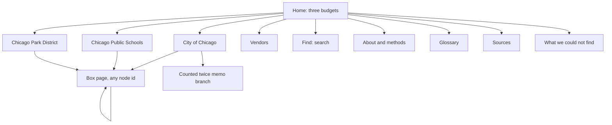

# Website plan: the Chicago 2026 budget explorer

Status: PLAN ONLY (2026-10-03). Nothing in this document has been built. It describes what to build, in what order, and how to prove it is right. The user has not approved building yet. Every number in this plan was read from `data/budget.db` (build of 2026-10-02 17:40) or from the research files it cites.

Read with: `build/README.md` (the tree), `build/SPLITS.md` (how detail gets added), `research/tree_gap_audit_3.md` (what the data does and does not do), `research/payments_dedupe.md` (the vendor view), `research/midyear_contracts.md` (the 2025 coding caveat), `research/value_context.md` (per resident math and its limits).

## 0. One paragraph summary

A static website, no server, built only from `data/budget.db`. Three budgets side by side: City of Chicago ($16,842,553,003.00 net), Chicago Public Schools ($10,253,327,463.68) and the Chicago Park District ($637,580,350.00). You open a budget and see a handful of big boxes. You tap a box and see the boxes inside it. You keep going until the boxes are small (most of the way to under $1M) or until a box tells you, in one plain sentence, why it cannot be opened further. Every box shows its amount, where the number comes from, what kind of number it is (printed in the budget, a government estimate, our estimate, a leftover, an adjustment, or money already paid), and any extra facts that go with it. The site never shows a person's name. It says plainly how much of each budget reaches a small box and how much does not.

## 1. Goals and non-goals

### Goals

| # | Goal | How we will know |
|---|---|---|
| G1 | A 13-year-old can start at "City of Chicago" and reach a box under $1M without help | Kid usability test (section 15.5): 5 of 6 testers finish task 1 in under 3 minutes |
| G2 | Every box has an amount, a basis, at least one source and (on leaves of $10M or more) a why sentence | Export validator fails the build otherwise (section 13) |
| G3 | Nothing on the site is invented. Every number traces to a row in `budget.db` | The export is the only data path. No hand-typed numbers in the site code, except UI labels |
| G4 | No individual's name appears anywhere | Pre-deploy leak check (section 13.4) blocks deploy on any hit |
| G5 | Honest about limits: the "counted twice" branch, negative boxes, estimates, leftovers, and the share of dollars that never reach a small box are all visible and explained | Coverage figures from the `checks` table shown on every budget's front page and on the "What we could not find" page |
| G6 | Fast and cheap: static files, loads in under 3 seconds on a mid-range phone on 4G, hosting under $10 a month | Size budgets in section 11, Lighthouse performance 90 or better |
| G7 | Accessible: WCAG 2.1 AA, full keyboard use, screen reader friendly, color-blind safe | axe-core clean, manual VoiceOver and NVDA pass (section 10) |

### Non-goals (for the first release)

- No live data. The site is rebuilt when the database is rebuilt. No API calls at run time.
- No user accounts, comments, saving or sharing beyond a plain URL.
- No editing the data from the site. Corrections go through the split files and a rebuild.
- No budget history charts over many years (only the prior year facts already in `side_info`).
- No other governments (CTA, Cook County, City Colleges, CHA). The site says why they are missing.
- No ranking of "good" or "bad" spending. The site shows numbers and sources, not opinions.
- No Spanish or other translations at launch, unless the user decides otherwise (open question 6). The UI will be built so translation is possible later.

## 2. Audiences

| Audience | What they want | What the design does for them |
|---|---|---|
| A 13-year-old (the design target) | Understand where the money goes without jargon | Kid-friendly box names (already in `nodes.name`), one idea per screen, glossary words highlighted, amounts in words ("$2.1 billion") with the exact figure one tap away |
| Parents, teachers | Find their school, park or neighborhood service | Search by school (640 CPS school boxes), park (230 park boxes), department |
| Reporters, watchdogs, City Council staff | Check a number against the source, see vendors and payments, download data | Source link on every box, official name in the details, vendor pages, exact cents, JSON download per box |
| City, CPS and Park District staff | See how their line was split, and object if it is wrong | Basis badge and method note on every estimate, a "report a problem" link with the box id |
| Screen reader and keyboard users | Same content, same depth | Every tile is a real button in a list, a table view mirrors every box view |

## 3. What the data gives us (facts the design must fit)

From `data/budget.db` (64.7 MB):

| Fact | Value |
|---|---|
| Boxes (`nodes`) | 47,343: City 15,403 (of which 238 in the `city-twice` memo branch), CPS 24,894, Parks 7,046 |
| Leaves | City 11,958, CPS 20,141, Parks 6,124 |
| Parents (boxes you can open) | 9,120 |
| Boxes with exactly one child | 580 |
| Boxes with 51 to 200 children | 17 (largest: an O'Hare organization unit with 175, CPS charter schools 121) |
| Max depth | City 9, CPS 8, Parks 6 |
| Side facts (`side_info`) | 13,880 rows on 2,329 plus other boxes, about 130 distinct `kind` values |
| Negative boxes | City 260, CPS 23, Parks 411 (vacancy savings, offsets, 14 "paid beyond the line" boxes, the -$116,988,502 OBM adjustment, 274 Parks rounding boxes of $10 or less) |
| Count x rate boxes | 11,833 (`count` is set), for example "4 positions x $113,568.00 (grade BX 18)" |
| Box ids | lowercase letters, digits, dots and dashes only, longest 274 characters, average 98. Safe to use in URLs as they are |
| Distinct source JSON values | 3,662 on boxes, 297 on side facts |
| Em dashes in names, notes, why sentences or side labels | 0 |
| Largest subtree | `cps.schools` holds 21,569 boxes. The biggest natural chunks are the three Parks regions (about 2,000 boxes each) and CPS networks (about 1,400 to 1,800 each) |

Basis values in use: `budget`, `tied`, `gov_estimate`, `proxy`, `residual`, `adjustment`, `paid_to_date`. Only City uses `gov_estimate` (219 boxes). Only City and CPS use `paid_to_date` (1,568 and 50).

Coverage (from the `checks` table, share of absolute leaf dollars by the size of the box where clicking stops):

| Government | Under $1M | $1M to $10M | $10M or more |
|---|---:|---:|---:|
| City | 42.2% | 14.2% | 43.7% |
| CPS | 57.7% | 15.2% | 27.1% |
| Parks | 48.5% | 33.9% | 17.5% |

(These are the strict figures by each leaf's own amount. `build/README.md` also prints a looser "build rule" where N x rate boxes count as small. The site should show the strict figures, because that is what a visitor experiences when clicking.)

Useful `extra` keys the site can use: `official_name` (29,170 boxes), CPS `money_comes_from_cents` and `program_areas_cents` (17,855 boxes), `fte`, `enrollment_2024_25` (620 schools), `park_number` and `region` (230 parks), `midyear_contract` (492 boxes matched by 2025 coding), `also_on_other_lines` (75 boxes), bond fields (`principal_cents`, `interest_cents`, `fixed_rate`, `final_maturity`), `contract`, `payments`.

Reconciliation the site must state: City net $16,842,553,003 + "counted twice" $1,709,026,955 + the unexplained OBM adjustment $116,988,502 = gross ordinance $18,668,568,460, to the dollar.

## 4. Information architecture and page list



| Route | Page | Built from |
|---|---|---|
| `/` | Home. Three cards with totals in words, a one-line "what is a budget" intro, search box, links to About and Glossary | `nodes` roots, `checks` |
| `/city`, `/cps`, `/parks` | Budget front page: the root box page plus a coverage strip ("X cents of every dollar reach a box under $1M") and, for the City, the "counted twice" card | root node, `checks`, `city-twice` root |
| `/city/box/<id>` and the same for cps and parks | Box page. The core of the site (section 5). The id is the `nodes.id` | chunk JSON |
| `/city/counted-twice` | The memo branch, framed as "money that moves between City funds, shown so the gross figure adds up, not part of the $16.84 billion" | `city-twice` subtree |
| `/vendors` | Companies paid by the City: 2026 so far (through 09/28/2026, partial year) and 2025 | vendor nodes and payment side facts (section 7) |
| `/vendors/<slug>` | One vendor: which boxes it appears in, payments by year, contract numbers | same |
| `/find` | Search results page (also an inline search in the header) | search index JSON |
| `/jobs` | Job titles across the three governments: budgeted positions and rates, no names, 2025 actual pay by title where the group has 5 or more people | job title nodes and `pay_2025` side facts |
| `/schools` | All CPS school boxes with enrollment and budget per student | `kind = school` nodes, `enrollment` side facts |
| `/parks-list` | All 230 Park District park boxes by region | `kind = park` nodes |
| `/about` | About and methods | hand-written, numbers pulled from the export manifest |
| `/glossary` | Words a 13-year-old will meet, each in one or two sentences | hand-written |
| `/sources` | Every document and dataset used, with links, grouped by government | distinct `source` JSON |
| `/gaps` | "What we could not find": the ranked dead ends, the coverage table, what it would take | leaves of $10M or more from `nodes`, plus hand-written context from audit 3 |
| `/box/<id>.json` | Raw JSON of one box, its children and side facts, for anyone who wants the data | export |
| `/404` | Friendly not-found with search | |

Header on every page: site name, the three budgets, Find, About. Footer: data build date, "Paid so far" cut-off date, link to Sources, link to report a problem (a GitHub issue link or an email, open question 8).

## 5. The core interaction: opening boxes

### 5.1 Choice: one level of nested boxes at a time

Three options were considered.

| Option | Good | Bad | Verdict |
|---|---|---|---|
| Zoomable treemap (all levels at once, zoom in and out) | Shows proportion everywhere, looks impressive | Hard on phones, tiny labels, negative amounts cannot have area, confusing for kids, poor for screen readers | No |
| Plain list with indent (like a file tree) | Simple, accessible, works everywhere | Loses the feeling of "how big is this compared to that", which is the point of the site | Use as the alternate view |
| **One level of nested boxes** (the current box is a container, its children are tiles sized by amount, tap a tile to make it the container) | Proportion is visible, one idea per screen, each tile is a plain button, works on phones as a stacked list | Needs rules for many children and for negatives | **Yes, recommended** |

How a box page looks, top to bottom:

1. **Breadcrumb trail**: "City of Chicago > Keeping people safe > Chicago Police Department > Overtime". Each crumb is a link. On phones the trail collapses to "... > Chicago Police Department > Overtime" with a tap to expand.
2. **The box header**: name in large type, amount in words ("$211.6 million"), the basis badge, and one line of context (for example "1 of 7 boxes inside Chicago Police Department, 10% of it"). Below it, the note from `nodes.note` if there is one, and for leaves the why sentence.
3. **The tiles**: children drawn as a squarified treemap in a fixed-height area (about 60% of the viewport height on desktop, a stacked list of bars on screens narrower than 640 px). Rules:
   - Up to 20 tiles are drawn. If a box has more than 20 children, the 19 largest are drawn and the rest become one tile "N smaller boxes" that opens an inline list sorted by amount (this covers the 17 boxes with 51 to 200 children and the 112 "Other vendors" groups).
   - A tile shows the name (clipped to two lines, with the full name on focus and in the list view), the amount in words, and a small basis badge. Tiles too small for text show only a color and get their text in the list below.
   - Tiles are `<button>` elements inside a `<ul>`, sorted by amount, so keyboard and screen reader order is the same as visual size order.
   - Negative children are never drawn as tiles (area cannot be negative). They go in a separate strip under the treemap (section 6.2).
4. **"Also shown as a list"**: a table under the tiles with name, amount, share, basis, and an "open" link. This is the same data as the tiles and is always present (not hidden behind a toggle), because it is the accessible version and the place where long names can be read in full.
5. **Side facts** (section 6.3), **sources** (section 6.4), and a small **"Get this box as JSON"** link.
6. **Up one level** button at the bottom, mirroring the breadcrumb.

### 5.2 Mobile first

- Designed at 360 px wide first. Tiles become a vertical list where each row has the name, the amount, and a horizontal bar whose length is the share of the parent. Tapping a row opens it.
- Tap targets at least 44 x 44 px. Amount and name both tappable.
- No hover-only information. Anything in a tooltip is also in the list view.
- Sticky header with the breadcrumb's last crumb and a back arrow.

### 5.3 Deep links, back and forward

- Every box has a stable URL: `/<gov>/box/<node id>`. The id is already URL safe (letters, digits, dots, dashes; longest 274 characters, well under browser limits).
- The browser back button always goes up one step in the user's history, not one level in the tree (history API, no hash routing).
- The "Up one level" button goes to the parent.
- Sharing a link opens that box directly, with its breadcrumb trail filled in (the trail comes from the id prefix and the spine file, so no extra fetch is needed for the trail).
- If an id does not exist (old link after a rebuild), show the nearest existing ancestor with a notice "This box was renamed or moved in the latest build. Here is the box that contains it."

### 5.4 Collapsing boxes with one child

580 boxes have exactly one child with the same amount. Opening them is a wasted tap. Rule: when a box has one child, the box page shows that child's children directly, and the breadcrumb shows both names ("Firemen's retirement fund > Extra payment above what the law requires"). The intermediate box keeps its own URL, which redirects client-side to the same view.

### 5.5 Reading amounts

| Amount | Shown as | Exact figure |
|---|---|---|
| $1 billion or more | "$16.84 billion" (two decimals) | Full dollars and cents in the header on tap ("$16,842,553,003.00") and always in the list view and JSON |
| $1M to $1B | "$211.6 million" (one decimal) | same |
| Under $1M | "$406,560" (whole dollars) | cents on tap |
| Negative | "takes away $98.0 million" with a minus sign in the list | same |

Rounded figures in tiles may not add up visually. The list view shows exact cents and a footer row "These add up to the box above, to the cent", which the export validator guarantees.

Count x rate boxes show the formula: "4 positions x $113,568 each".

## 6. Showing basis, negatives, side facts, sources and why

### 6.1 Basis badges

Each basis gets a short label, a one-sentence meaning (used in a tooltip, in the list view and in the glossary), a color, and a shape or pattern so color is never the only cue.

| Basis | Label on the site | Plain meaning | Visual |
|---|---|---|---|
| `budget` | In the budget | This exact number is printed in the budget document. | Solid fill, dark blue, no icon |
| `tied` | Adds up exactly | The government published a list that adds up to this number exactly. | Solid fill, teal, small "=" icon |
| `gov_estimate` | Government estimate | The government published this number as an estimate, not a final figure. | Solid fill, purple, small "~" icon |
| `paid_to_date` | Paid so far | Money actually paid out between January 1 and September 28, 2026. Not the whole year. | Solid fill, green, check icon, and the date always printed |
| `proxy` | Our estimate | We worked this out ourselves from public data. The note says how. Treat it as rough. | Dashed border, diagonal stripes, orange, "?" icon |
| `residual` | Leftover | What is left of a bigger box after we named everything we could. | Dotted border, light gray fill, "..." icon |
| `adjustment` | Adjustment | A number the budget uses to make totals come out right, often negative. | Hatched border, gray, "+/-" icon |

Rules:

- `proxy`, `residual` and `adjustment` tiles always carry their badge text, even on small tiles, because the user asked that our estimates and leftovers be unmistakable.
- A `proxy` box must show its method note (`nodes.note`) directly under the header, not behind a tap. Audit 3 found 248 CPS proxy boxes with an `fte` count in `extra` but no note text. For those the site prints a generic sentence built from the data: "Our estimate: this title's share of the line, split by its N full-time positions." (That sentence states what the build did and uses only the `fte` value from the data.)
- Every budget front page has a one-line legend linking to the glossary.

### 6.2 Negative boxes

Negative boxes are shown, never hidden. Under the treemap, a strip titled "Boxes that take money away" lists each negative child with its amount, badge and note. Above the strip, a one-line equation shows how the parent total is reached: For the Police Department's Corporate Fund "Salaries and Wages - on Payroll" line: "Boxes above add up to $1,536.8 million. Minus $98.0 million of budgeted turnover (vacancy savings). Equals $1,438.8 million." (Real figures from the database: positives $1,536,786,812, negative -$97,986,868, parent $1,438,799,944.) The numbers are computed from the children at export time and checked.

The three families of negative boxes get their own plain explanations in the glossary, linked from the strip:

- Vacancy savings (212 City boxes, CPS vacancy factor, Parks vacancy allowance): "The budget assumes some jobs will be empty for part of the year, so it subtracts the pay that will not be spent."
- Paid beyond the line (14 City boxes, -$181.0M, largest police settlements -$151.7M): "More has already been paid this year than the budget set aside. The negative box keeps the total honest."
- Adjustments the budget office makes (-$116,988,502): "The City's own total is lower than its lines add up to. No document explains the difference. We show it as its own box rather than hide it."

The Parks rounding boxes ($10 or less, 274 of them) are grouped into one tile "Rounding in the printed budget" when they share a parent, with the list available.

### 6.3 Side facts

`side_info` rows are facts attached to a box that are not added into its amount. The site always introduces them with the sentence "These facts go with this box. They are not added into the amount above." They are grouped into sections by `kind`. The export carries a kind-to-section map, and any kind not in the map lands in "More facts" so nothing is dropped.

| Section title on the site | Kinds (examples) | How it is shown |
|---|---|---|
| Paid so far in 2026 | `vendor_payment`, `vendors_paid`, `contract_family_paid_2026`, `paid_to_date` | Table of payees, amount, payment count, contract number. Header says "January 1 to September 28, 2026, partial year". Individuals appear as "Individual (name hidden)" |
| Estimated 2026 share (not in the boxes) | `estimate_2026_multi_line_contracts` | Same table, but inside a dashed "Our estimate" frame, with the row's own label (it already starts with "ESTIMATE, not in the boxes") |
| Who was paid in 2025 | `paid_2025_vendors`, `vendor_payment_prior_years` | Table, labelled "2025 invoices, for comparison only" |
| Last year | `prior_year_budget`, `prior_year_actual`, `pay_2025`, `pay_2025_actual` | Two or three numbers side by side: 2025 budget, 2025 actual, 2026 budget, with a small bar. `pay_2025` groups under 5 people show counts only (section 8) |
| People and students | `enrollment`, `retirees`, `active_payroll`, `health_enrollment_basis` | Count cards: "4,069 students enrolled (2024-25)" |
| Pension facts | `funded_ratio`, `unfunded_liability`, `recommended_contribution`, `gap_vs_recommended`, `amortization_payment`, `amortization_target`, `benefits_paid`, `annual_benefits_in_force`, `member_contributions`, `total_normal_cost`, `advance_history`, `advance_payment_2026`, `advance_savings`, `projected_payroll` | The pension explainer layout (section 7.3) |
| Loans and bonds | `debt_facts`, `debt_context`, `bond_uses`, `derived_principal`, `iepa_loan`, `iepa_aggregate` | Fact list with the series, rate, final year |
| Projects | `ledger_project`, `capital_*`, `drgr_activity`, `idot_*`, `tip_*`, `faa_*`, `federal_*` | Table of project names and amounts, each row with its own source |
| What the government says | `official_explanation`, `official_plan`, `context`, `budget_overview_cap`, `statute_context`, `revenue_that_pays`, `revenue_context` | Quoted text with the document and page |
| More facts | everything else | Label, amount, period, basis, source |

Each side fact row shows its own `period`, `basis` (in the same badge style) and source link. The 171 side facts on `parks.building-and-fixing-parks` are the most on any box, so the sections collapse by default past the first 10 rows.

### 6.4 Sources

Every box shows "Where this number comes from" with the source document or dataset name, page if given, and a link. The source JSON has `doc` or `name`, `dataset`, `url`, `page`, `file`, `note`. Display rules: show `doc` or `name`, then "page N" if present, then the link. `file` (a local path) is shown only on the Sources page as "our extract". Side facts show their own source the same way. The Sources page lists all 3,662 plus 297 distinct source values, grouped by government and document, deduplicated by URL.

### 6.5 The why sentence

Every leaf of $10M or more has `why_cant_go_deeper`. The site shows it on every leaf that has one (597 City, 303 CPS, 16 Parks), as a highlighted paragraph: "Why you can't open this box: ...". 47 parents also carry a sentence from before they were split. Rule: show the why sentence only on leaves, never on parents (audit 3 calls those harmless if hidden on parents). Leaves under $10M with no sentence get a short standard line: "This is the smallest piece our data shows." (This states a fact about the data, not a number.)

### 6.6 The 2025 coding caveat on contract boxes

492 boxes carry `extra.midyear_contract = true` and the note "Matched to this line using how the City coded this contract's 2025 invoices." These boxes always show a caveat badge "Matched by 2025 coding" next to the basis badge, and the note is printed on the tile's list row and on the box page header, not only in details. The sibling "Budgeted but not spent yet" box on those lines is shown with its own why sentence from the data plus the caveat badge, so a reader sees both boxes are built on the same matching. Audit 3 item 3 asks for that remainder sentence to be improved in the build (section 13.6 lists it as a data prerequisite).

The `also_on_other_lines` note (75 boxes) is shown as a warning line: "This project also has boxes on other lines. Do not add them up." with the list.

## 7. Paid so far, vendors and pensions

### 7.1 "Paid so far" as boxes

Boxes with basis `paid_to_date` are regular tiles (green, check icon). Their parent line shows the equation: "Budget for this line $X. Paid so far $Y (through September 28, 2026). Budgeted but not spent yet $Z." If Y is larger than X the negative "Already spent more than the budget" box appears in the negatives strip with its explanation. The phrase "partial year" and the cut-off date appear every time a 2026 payment figure is printed. The site never shows a projected full-year figure.

### 7.2 Vendor view

Requirement: the site is built only from `budget.db`. Vendor facts in the database today are attached to boxes: 1,568 City `paid_to_date` vendor and contract boxes, 1,127 `paid_2025_vendors` side facts (one per line), 428 `estimate_2026_multi_line_contracts` side facts, 232 `vendor_payment`, 41 `vendors_paid`, 22 `contract_family_paid_2026`, plus 50 CPS `paid_to_date` boxes (23 of them `kind = vendor_payment`). There is no vendor table.

Plan:

1. **Data prerequisite (a build change, small):** add a `vendors` table to `budget.db` in `build/city_tree.py` (or a new `build/vendors_table.py` run by `build_all.sh`) from the deduplicated payment files that already feed the tree, with one row per (payee, year, contract): `payee_display` (business name or "Individual (name hidden)", decided by `build/payee.py`), `is_individual`, `year` (2025 or 2026 YTD), `amount_cents`, `n_payments`, `contract_number`, `department`, `linked_node_ids` (JSON). The same privacy scan that runs on `nodes` and `side_info` runs on this table. This keeps the site inside the "only from budget.db" rule and avoids the site code inventing vendor totals by adding up side facts, which would double count the proxy estimate rows.
2. `/vendors`: table of business payees, columns "Paid in 2026 so far (Jan 1 to Sep 28, partial year)" and "Paid in 2025 (full year)", sortable, searchable, with the dedupe note from `research/payments_dedupe.md` summarized in one sentence and linked. Individuals are pooled into one row "Individuals (names hidden), N payees" per year with the total, so the dollars are not lost.
3. `/vendors/<slug>`: one business, both years, contract numbers and descriptions, the boxes in the tree it appears in (with the 2025 coding caveat badge where it applies), and the plain sentence "A 2026 figure is nine months of payments. Do not compare it to a 2025 full year without noticing that."
4. Never annualize. No "on track for" figures anywhere.

If the user does not want the build change, the fallback is a vendor list derived only from `paid_to_date` boxes and the actual-payment side kinds (excluding the proxy estimate kind), with a clear note that it is "payments we could place on a budget line", which is a smaller set. Open question 9.

### 7.3 City pensions, as rich as the data allows

The four City funds (`city.retirement.*`) have a consistent shape: contribution line, split into "Cost of pensions workers earn this year" (tied) and "Paying down the shortfall (money promised but never saved)" (proxy), plus the advance contribution line, and 66 side facts across the four funds. Build a pension layout used whenever a box's id starts with `city.retirement.` and the box is a fund or a contribution line:

- A headline strip from side facts: funded ratio ("27.42% funded" for MEABF, with the asset and liability figures from the label), unfunded liability, recommended versus statutory contribution and the gap, and the 2058 target from `amortization_target`.
- "Who the fund pays": the `retirees` count x average items as cards ("21,874 retired members, average $49,104 a year"), which are group figures from the fund's valuation, not individuals.
- "Who pays in": `active_payroll` (and Tier 1 and Tier 2 for Police), `member_contributions`.
- "Extra payments": `advance_history` as a small timeline and `advance_payment_2026` and `advance_savings`.
- "Paid in 2025": `benefits_paid` with its breakdown text.
- The normal treemap of the fund's boxes under the strip.

CPS (`cps.pensions`) and Parks (`parks.retirement-pensions`) use the same layout with whatever side facts exist (CPS has the pension reserve proxies, Parks has two boxes). The layout only renders cards for kinds that exist; it never shows a placeholder number.

## 8. Privacy rules the site enforces

| Rule | Where enforced |
|---|---|
| No individual names anywhere | Build (`build/payee.py`, roster scan) and pre-deploy leak check on the final `dist/` files |
| Payments to individuals show as "Individual (name hidden)" | Already in the data. The site must not alter this string and must not show payee descriptions for individuals beyond what is in the data |
| Business names shown | As in the data |
| Job titles: totals only, groups under 5 people get no averages | Export: for `pay_2025` side facts where `n_paid_2025 < 5` or `n_current < 5`, drop every field except the counts and the budgeted 2026 figures (which are printed in the ordinance). 165 such rows exist. Budget boxes like "1 positions x $90,732" stay, because that is a budgeted rate for a position from the public ordinance, not a person's actual pay. CPS titles under 5 in a unit are already pooled as "Other job titles (fewer than 5 positions each)" (1,137 boxes) |
| Only `budget.db` ships | The export reads one file. `data/people/`, `raw/`, `data/*.json` are never referenced by site code. The leak check also fails if any path under `data/people` or `raw/` appears in `dist/` |
| Pre-deploy leak check | Section 13.4 |

The two person-named $6,000 boxes that audit 3 found were fixed in commit `aaae712`. The leak check will catch any return.

## 9. Search

One search box in the header, one results page at `/find`. Client-side, no server.

| What you can find | Index source | Rows (approx.) |
|---|---|---|
| Any box of $1M or more | `nodes` with `abs(amount_cents) >= 100,000,000` | 8,015 |
| Departments | `kind` in department, org_unit (City 74, CPS 102, Parks 46 departments) | about 870 |
| Schools | `kind = school` | 640 |
| Parks and venues | `kind` in park, venue, institution | 256 (230 parks, 14 venues, 12 institutions) |
| Job titles | distinct names of `kind` in job_title, job_title_group, position | 1,672 |
| Vendors (businesses only) | `vendors` table (section 7.2) or vendor boxes | 1,123 vendor and contract boxes today, about 4,800 distinct payees in side facts |
| Glossary words | hand-written | about 60 |

Design:

- The index is a JSON file per government plus one for vendors, loaded on first keystroke (a trimmed index of about 14,000 rows is about 0.3 MB gzipped, measured on today's data).
- Search runs in the browser with a small fuzzy matcher (for example MiniSearch or Fuse.js, both under 10 KB gzipped). Prefix and typo-tolerant, so "polce" finds Police.
- Results show the name, the amount, the basis badge, and the breadcrumb path, because the same name appears many times ("Other job titles (fewer than 5 positions each)" appears 1,137 times and is useless without its unit). Grouped by type (Departments, Schools, Boxes, Vendors, Jobs, Words).
- Results are a list of links, keyboard navigable, announced to screen readers ("12 results").
- Search never indexes anything hidden by the privacy rules, because it is built from the same exported JSON.

## 10. Accessibility (WCAG 2.1 AA)

| Need | What we do |
|---|---|
| Keyboard | Every tile is a `<button>` in a `<ul>`; Tab order is size order; Enter opens; Escape or Backspace goes up one level; a skip link jumps to the tiles; focus is moved to the box header after navigation and announced |
| Screen readers | Each tile's accessible name is "Name, amount, basis, share of parent" (for example "Overtime, 211.6 million dollars, in the budget, 10 percent"); the list view is a real `<table>` with headers; the treemap region has `aria-label` and the list is marked as the alternative; live region announces "Now inside Chicago Police Department, 7 boxes" |
| Color-blind safety | Basis is shown by label text and pattern or icon as well as color; the palette is checked with a deuteranopia and protanopia simulator; negatives use a hatch pattern plus a minus sign, not red alone |
| Contrast | 4.5:1 for text, 3:1 for tile borders and icons; text on tiles sits on a solid label background, not directly on the fill |
| Motion | No animation when `prefers-reduced-motion` is set; the treemap transition is a simple fade, under 200 ms |
| Zoom and reflow | Works at 400% zoom and 320 px wide (tiles become the list) |
| Reading level | UI text written for a 13-year-old, checked with a readability tool at grade 7 or lower; box names come from the data |
| Touch | 44 px targets, no hover-only content |
| Language | `lang="en"`, and a `lang` attribute on any Spanish content if translation is added later |
| Testing | axe-core on every page type in CI, Lighthouse accessibility 100, a manual VoiceOver (Safari, iOS) and NVDA (Firefox, Windows) pass of the box page, search, vendor page and glossary before launch |

## 11. Performance with 47,343 boxes

### 11.1 Measurements on today's data

- All boxes and side facts as JSON: about 25 MB raw. The Parks tree alone is 9.6 MB raw and 0.31 MB gzipped (a 31 to 1 ratio, because sources and labels repeat).
- Cutting the tree into subtree chunks at any node whose subtree has more than 300 boxes gives 85 chunks, median 308 KB raw, 90th percentile 863 KB raw, largest 1.45 MB raw (Parks South region, 2,013 boxes). Gzipped, with side facts included, the five largest chunks are CPS networks at 105 KB to 143 KB (the Independent Schools network, 1,786 boxes, is the biggest). A cut at 150 boxes gives 145 chunks, median 139 KB raw, if a smaller per-chunk budget is wanted.
- The "spine" (all boxes at depth 3 or less) is 1,674 boxes, 94 KB gzipped (measured), and gives every breadcrumb trail and the first three levels without a second fetch.

### 11.2 Design

| Piece | What it holds | Budget (gzipped) |
|---|---|---|
| `manifest.json` | Build date, totals, coverage, cut-off dates, chunk index (node id prefix to chunk file) | 20 KB |
| `spine.json` | Every box at depth 3 or less, full records, with `child_count` and `chunk` for each | 100 KB |
| `chunks/<root id>.json` | One subtree, cut at 300 boxes (today's largest is 143 KB gzipped, so the export should cut at 200 boxes or drop repeated source JSON into a shared `sources.json` lookup to leave headroom). Full records and the side facts of every box in it. Children of a cut point are listed as stubs (id, name, amount, basis, is_leaf) so tiles can draw before the next chunk loads | 150 KB each, hard limit; the validator fails if any chunk exceeds it |
| `search/<gov>.json`, `search/vendors.json` | Trimmed index | 150 KB each |
| `vendors/<slug>.json` | One vendor's page data | 50 KB each |
| App JavaScript | Router, treemap layout, formatters, search | 60 KB initial, 120 KB total |
| CSS and fonts | System font stack, no web fonts | 15 KB |
| Images | None except an SVG logo and icons | 10 KB |

Loading rules: fetch `manifest` and `spine` once (cached, immutable file names with a content hash). On a box page, fetch its chunk, then prefetch the chunks of the visible children when the browser is idle. Per-box JSON at `/box/<id>.json` is written for every parent (9,120 files) for the download link only, never used by the app. The app never loads more than about 400 KB on the wire to reach any box from a cold start.

Pre-rendering: pages for every box at depth 4 or less (4,981) plus every box of $1M or more (8,015, overlapping) are rendered to static HTML at build time, so the first paint needs no JavaScript and search engines can index them. Deeper boxes are served by the same shell page with a client-side router and a `404.html` fallback that reads the id from the URL. Total static pages roughly 10,000, well inside hosting limits (section 14).

Targets: Largest Contentful Paint under 2.5 s and Interaction to Next Paint under 200 ms on a Moto G class phone on throttled 4G, Lighthouse performance 90 or more. Measured in CI with Lighthouse CI on five fixed pages.

## 12. Tech stack options and recommendation

| Option | What it is | For | Against |
|---|---|---|---|
| A. Astro with Svelte islands (TypeScript, Vite) | Static site generator that ships zero JS by default, adds small interactive islands | Pre-renders 10,000 pages fast, islands keep JS tiny, file-based routing, good docs, works with any host | Two frameworks to learn (Astro pages plus Svelte components) |
| B. SvelteKit with the static adapter | Full framework, prerender everything, SPA fallback | One mental model, strong routing and data loading | Heavier runtime than Astro islands, prerendering 10,000 pages is slower and can need tuning |
| C. Plain HTML, CSS and a small vanilla JS app with a Python prerender step | No framework | Smallest possible output, nothing to upgrade | More hand-written code for routing, templates, hydration and tests, slower to build and easier to get wrong on accessibility |
| D. Next.js static export | Popular React framework | Large ecosystem | Biggest JS payload of the four, static export has limits, React is more than this site needs |
| E. Observable Framework | Data-app static generator with built-in data loaders | Great for charts | Opinionated notebook style, weaker for a product site with 10,000 pages and a11y work |

**Recommendation: A, Astro with Svelte islands, TypeScript, Vite.** Reasons: it is static with no server (the hard requirement), the pre-rendered HTML gives fast first paint and SEO for every important box, the islands keep the JavaScript budget in section 11 reachable, and Svelte makes the treemap and search components short and readable. Treemap layout: D3's `d3-hierarchy` squarify (about 5 KB) or a 60-line hand-written squarify; no full D3. Search: MiniSearch. Tests: Vitest (unit), Playwright (end to end and snapshots), axe-core through `@axe-core/playwright`, Lighthouse CI. Linting: ESLint, Prettier, and a custom lint rule that fails on an em dash character in any file under `site/`.

The site lives in a new `site/` folder in this repository. The export step (section 13) is Python, next to the existing build scripts, so one `build/build_all.sh` run produces both the database and the site data.

## 13. Data export pipeline and validation

### 13.1 Steps wired into `build/build_all.sh`

Today the script runs the three tree builders then `verify_db.py`. Add two steps:

```
python3 build/verify_db.py
python3 build/export_site.py        # budget.db -> site/public/data/
python3 build/validate_site_data.py # fails the build on any problem
```

Both read only `data/budget.db` (and the hand-written content files under `site/content/`). They never open `data/people/`, `raw/` or `data/*.json`.

### 13.2 `build/export_site.py`

Writes `site/public/data/`:

- `manifest.json`: build time (from `checks.run_at`), the three official totals, the `city-twice` total, the gross check, coverage shares from `checks.depth`, the payments cut-off date (09/28/2026, read from the `period` strings of `paid_to_date` facts, not hard-coded), chunk index, counts.
- `spine.json`, `chunks/*.json`, `box/<id>.json` as in section 11.
- `search/*.json`.
- `vendors.json` and `vendors/<slug>.json` from the `vendors` table (section 7.2), or the fallback.
- `sources.json`: distinct sources grouped and deduplicated.
- `gaps.json`: every leaf of $10M or more, with amount, basis, why sentence and path, sorted by absolute amount, per government (City 342, CPS 137, Parks 8 today), plus the counts of negative boxes, proxies and residuals by government.
- `jobs.json`, `schools.json`, `parks.json` index pages.
- Record shape per box: `id, parent_id, gov, kind, name, official_name, amount_cents, basis, count, unit_amount_cents, unit_label, why, note, source, is_leaf, n_children, depth, extra (whitelisted keys only), side (array)`.

Transformations (all mechanical, none change a number):

- `extra` is whitelisted to the keys section 3 lists as useful. Internal keys (`build_id`, `inv_path`, `via`) are dropped.
- `pay_2025` side facts for groups under 5 are stripped to counts and budgeted figures (section 8).
- Side facts get a `section` from the kind map.
- Names over 100 characters (465 today) keep the full text in `name` and get a `short_name` cut at the last space before 80 characters with an ellipsis, for tiles only.
- Siblings of one-child boxes get a `collapse_into` pointer (section 5.4).

### 13.3 `build/validate_site_data.py` (fails the build)

| Check | Rule |
|---|---|
| Totals tie to the cent | Root amounts equal $16,842,553,003.00, $10,253,327,463.68, $637,580,350.00; `city-twice` equals $1,709,026,955.00; City + twice + 11,698,850,200 cents = $18,668,568,460.00 |
| Parent equals sum of children | For every parent, inside chunks and across chunk boundaries (stub amounts equal the real child's amount in its own chunk) |
| Every box in exactly one chunk | Count of full records across chunks equals the `nodes` count; no id twice |
| Every box has basis and source | Non-empty |
| Why on big leaves | Every leaf with `abs(amount) >= $10M` and basis not `adjustment` has a why sentence |
| No em dashes | No U+2014 in any exported JSON, in any file under `site/src/`, `site/content/` or the built `dist/` (also flag U+2013 as a warning) |
| Privacy, build time | No `pay_2025` group under 5 carries an average or total of actual pay; no exported string matches "LAST, FIRST" or "First Last &" patterns outside business-word names (the heuristics from `build/payee.py`, reused by import); no string "Individual (name hidden)" has been altered |
| No forbidden paths | No exported string contains `data/people` or `raw/` |
| Size budgets | Each chunk under 150 KB gzipped, spine under 100 KB, each search index under 150 KB |
| Ids are URL safe | Match `^[a-z0-9.-]+$` |
| Dates consistent | Every `paid_to_date` label and the manifest cut-off agree |
| Equations | For every parent with negative children, positives minus negatives equals the parent |

### 13.4 Pre-deploy leak check (`build/leak_check.py`, run only on the deploy machine)

This runs after `npm run build` against every file in `site/dist/`, and the deploy script refuses to upload without a fresh pass file. It needs the private lists, so it can only run on a machine that has `data/people/` and `raw/`:

1. Every name in `data/people/city_employees_2026.json` and `cps_positions_2025q4.json` (normalized, 6 characters or longer, both "First Last" and "Last, First" orders), scanned against the concatenated text of all `dist/` files. Zero hits required. This mirrors `treelib.check`'s roster scan but on the final output.
2. Every payee name the build hid (the list `build/payee.py` produces, saved to `raw/` during the build), scanned the same way. Zero hits.
3. The wider heuristics from audit 3 (couple patterns, names cut off at "&", artist grant descriptions) as warnings to review by hand.
4. No file under `dist/` has a path or content that came from `data/people/` (hash comparison of the files there).
5. Writes `site/dist/.leak-check-passed` with the dist hash. `site/deploy.sh` checks the hash matches before uploading.

CI (without private data) runs sections 13.3 and the tests. Deploy happens from the maintainer's machine, or from CI only if the user chooses to give CI the private lists (not recommended). Open question 2.

### 13.5 Content files

`site/content/` holds hand-written Markdown for About, Glossary, the intro to Gaps, and the UI strings file `strings.en.json`. The validator checks these for em dashes and for digits: any number in the content must be written as a template token (for example `{city_total_words}`) that the export fills from the manifest, so the content cannot drift from the data. A short allow-list covers fixed public facts the database does not hold (for example "the City Council passed the ordinance", years, page numbers).

### 13.6 Data prerequisites (fix in the build, not the site)

From audit 3 and this plan:

1. Done in `aaae712`: hide remaining couples and artist grant payees; fix the IEPA loan and sewer cleaning why sentences.
2. Improve the "Budgeted but not spent yet" why sentence on the 98 Mid-Year remainder boxes so it says payments coded to another line or paid without a contract number could also be inside it (a `why_fixes` split).
3. Add the `vendors` table (section 7.2), or decide on the fallback.
4. Add "2010B (MSAC)" to the two GO 2010B names so they cannot be confused (audit 3).
5. Consider a `glossary_terms` list or leave the glossary hand-written (recommended: hand-written, no numbers).

## 14. Hosting, domain, analytics, updates

| Topic | Options | Recommendation |
|---|---|---|
| Hosting | Cloudflare Pages (free, 20,000 files per deploy, 25 MB per file, global cache), GitHub Pages (free, 1 GB site, fewer headers controls), Netlify (free tier, 100 GB bandwidth) | Cloudflare Pages. Our output is about 10,000 HTML pages plus about 10,000 small JSON files, so keep the per-box JSON downloads to parents only (9,120) and confirm the count stays under 20,000, or move the `box/*.json` files to a second Pages project or R2 bucket. GitHub Pages is the fallback |
| Domain | User's choice (open question 1). Until then the `*.pages.dev` address | Buy through Cloudflare for simple DNS. HTTPS is automatic |
| Analytics | None; Cloudflare Web Analytics (no cookies, free); Plausible or GoatCounter (privacy-friendly, small fee or self-host) | Start with none or Cloudflare Web Analytics. No cookies, no consent banner needed. Open question 4 |
| Error reporting | None, or a client-side log of failed chunk fetches to a static endpoint | None at launch. Playwright and Lighthouse CI catch regressions |
| Updates | Payments data (`s4vu-giwb`) changes daily; the budgets change once a year (City amendments mid-year, CPS in summer) | A documented `make site` run: `build/build_all.sh`, `npm run build`, `build/leak_check.py`, `site/deploy.sh`. Monthly refresh of "paid so far" while 2026 is open, with the cut-off date changing on every page automatically. A changelog page lists each build date and what changed |
| Backups | The repository plus a copy of `budget.db` per published build under `raw/releases/` (gitignored) | Keep the last 12 |

## 15. Testing

### 15.1 Unit (Vitest)

Formatters (amounts in words, negatives, counts x rates), basis badge mapping (every basis value in the data maps to a label, unknown values throw), breadcrumb from id and spine, chunk index lookup, one-child collapse, negative strip equation, side fact sectioning, search index building, URL encoding and decoding of ids, em dash lint.

### 15.2 Data validation (Python, in `build_all.sh`)

Section 13.3, plus unit tests for `export_site.py` on a tiny fixture database with every basis, a negative child, a one-child chain, a cut point and a group under 5.

### 15.3 Snapshot tests (Playwright)

Rendered HTML of a fixed set of about 25 box ids chosen to cover: each root, a department, a line with vendors and a remainder, a line with a negative "paid beyond the line" box, a proxy with a note, a proxy without a note (CPS title split), a residual, an adjustment, a pension fund, a bond series, a CPS school, a Parks park, a one-child chain, a box with 175 children, the memo branch, a box with `also_on_other_lines`, a Mid-Year matched vendor. Snapshots are reviewed on every data rebuild.

### 15.4 End to end (Playwright, desktop and 360 px mobile)

1. From Home, open City, drill to any box under $1M in at most 9 taps, using only the tiles.
2. Same with keyboard only (Tab, Enter, Backspace) and with the list view only.
3. Deep link to a depth 8 box: breadcrumb complete, back button returns to the previous page, "Up one level" goes to the parent.
4. Search "Taft" finds the school; "Loevy" finds the vendor; "vacancy" finds the glossary word; "polce" finds Police.
5. A negative box is visible in the strip and the equation matches the parent to the cent (read from the page, compared to the JSON).
6. Every `paid_to_date` amount on a sampled page is followed by the cut-off date text.
7. The counted-twice card says it is not part of the City total.
8. 404 for a made-up id shows the nearest ancestor.
9. Offline after first load: previously visited boxes still open (service worker, optional, open question 10).

### 15.5 Accessibility

axe-core on each page type in CI (zero violations), Lighthouse accessibility 100, contrast check of the palette including patterns, manual screen reader scripts for the box page and search (written down, run before launch and after any layout change).

### 15.6 Kid usability test script

Six to eight testers aged 12 to 14, one at a time, 20 minutes, their own phone if possible, think-aloud, no help unless stuck for 2 minutes. Record success, time, and what they said.

| # | Task | Success means |
|---|---|---|
| 1 | "Find out how much the City plans to spend on police overtime this year." | Reaches the Overtime box under Chicago Police Department and reads a number |
| 2 | "Find your school (or any school) and how much it gets." | Uses search or Schools, reads the amount |
| 3 | "On that school page, find how many students it has." | Finds the enrollment side fact |
| 4 | "Find a box that says 'Our estimate' and tell me in your own words what that means." | Explanation matches the glossary meaning |
| 5 | "Find a box that takes money away and tell me why it is negative." | Finds a negative strip and reads the explanation |
| 6 | "Share a link to the box you are on with me." | Copies the URL; the URL opens the same box |
| 7 | "Why can't you open this box any further?" (on a leaf of $10M or more the tester reached) | Reads the why sentence and says it back |

Pass bar before launch: tasks 1, 2 and 6 done by at least 5 of 6 without help; every word a tester did not understand gets added to the glossary or replaced.

## 16. Content pages

### 16.1 About and methods (`/about`)

Sections: what this site is; the three budgets and the official totals; what a box is and the rule that boxes always add up; the seven kinds of numbers (basis), with the same badges; how we split big lines (one paragraph on positions and pay rates, vendors and payments, pensions, bonds, grants), pointing to `build/README.md` and `build/SPLITS.md` on GitHub; the dedupe rule for payments in two sentences; how names are hidden; the build date and the payments cut-off; who made it and how to report a mistake; a link to the repository.

### 16.2 Glossary (`/glossary`)

About 60 words, each in one or two sentences for a 13-year-old, with an example from the site. Must include: budget, appropriation, ordinance, fiscal year, fund, Corporate Fund, grant, pension, "cost earned this year", "shortfall", funded ratio, bond, principal, interest, refunding, vendor, contract, voucher, payment, "paid so far", partial year, "counted twice", transfer, vacancy savings, adjustment, estimate, proxy, leftover (residual), tied, position, FTE, job title, overtime, charter school, network (CPS), TIF, enrollment, per resident, per student, property tax, delegate agency, settlement, "name hidden". Words are linked from badges and from UI text with a dotted underline; the first use on a page gets the link.

### 16.3 Sources (`/sources`)

Every distinct source, grouped by government then by document, with URL and the number of boxes that cite it. Also the list of datasets used (6694-f78c, v2t2-vajc, s4vu-giwb, and the others named in the source JSON), and the dates they were fetched where the source JSON carries one.

### 16.4 What we could not find (`/gaps`)

Honest, in this order:

1. The coverage table from `checks` for each government, as a bar: "Of every dollar in the City budget, 42 cents reach a box under $1M, 14 cents stop between $1M and $10M, and 44 cents stop in a box of $10M or more."
2. "Where clicking stops": the ranked list from `gaps.json` of leaves of $10M or more, with the why sentence, basis badge and a link to the box. Filter by government and by the reason family (the why sentences fall into a dozen families, grouped by matching their text, for example "money not spent yet", "one bond series", "needs the budget office", "settlements involving private people").
3. "How many dollars rest on our own estimates": counts and totals of proxy, residual and adjustment boxes by government.
4. "What it would take": the hand-written list from audit 3 section 5 (the Department of Finance 2026 contracts file, CDOT reserves by project, FAA grant ledger, CPS contingencies, and the rest), written as asks, with no promise.
5. "Things we chose not to do": the counted-twice branch, no names, no annualizing, no history charts.

Numbers on this page come from the manifest and `gaps.json`, not from the text, so they update on every rebuild.

### 16.5 Comparisons (only if sourced)

`data/context_resident_2026.json` holds Chicago population 2,721,326 (ACS 2024 1-year), households 1,172,455, CPS 20th-day enrollment 316,224 for SY2025-26, and the Cook County Clerk tax rate split. These are not in `budget.db` today. To respect the "only from budget.db" rule, the build would add a small `context` table (key, value, source JSON) with those divisors. Then:

- Every City box can show "about $X per Chicago resident" and every CPS box "about $X per student", with the divisor and its source one tap away, and the sentence "This divides the box by everyone, which is not the same as what you pay." Parks boxes get per resident only.
- "What $1M buys": only comparisons that are themselves in the data: budgeted positions x rate boxes ("$1M is about N positions at this title's budgeted rate of $R"), chosen from the same government. No outside prices.
- The property tax split card on the Home page ("Of a typical Chicago property tax bill, 55.9% goes to CPS, 24.3% to the City, 4.5% to the Park District"), with the Clerk's report as the source.

If the user does not want the `context` table, comparisons are left out of the first release. Open question 7.

## 17. Milestones, effort and acceptance

Effort is for one experienced front-end developer who can also write Python, in working days. A second person roughly halves the calendar time for M2 to M6.

| # | Milestone | Days | Deliverables | Acceptance criteria |
|---|---|---:|---|---|
| M0 | Decisions and design | 2 | Open questions answered; wireframes of Home, Budget front, Box page (desktop and 360 px), Vendors, Gaps; palette and badge set with contrast and color-blind checks; UI strings draft | Wireframes approved by the user; palette passes 4.5:1 and a simulated deuteranopia check; strings have no em dashes and read at grade 7 or lower |
| M1 | Export and validation | 4 | `build/export_site.py`, `build/validate_site_data.py`, `build_all.sh` wired, fixture tests, `vendors` and `context` tables if approved | `build_all.sh` passes end to end; all checks in 13.3 pass on the real database; every chunk under 150 KB gzipped; export runs in under 60 seconds |
| M2 | Site skeleton | 5 | Astro project in `site/`, routing, chunk loader, spine, Box page with tiles and list view, breadcrumbs, up, deep links, one-child collapse, 404 to nearest ancestor, pre-render of depth 4 and $1M or more | Playwright tests 1 to 3 and 8 pass on desktop and mobile; Lighthouse performance 90 or more on a depth 8 box; initial JS under 60 KB gzipped |
| M3 | Meaning on every box | 5 | Basis badges and tooltips, negative strip and equation, side fact sections, sources, why sentence, 2025 coding caveat, `also_on_other_lines`, counted-twice framing, pension layout, paid-so-far equation with cut-off date | Snapshot set of 25 boxes approved; tests 5, 6, 7 pass; every basis in the data renders a badge (unit test enumerates them) |
| M4 | Find things | 4 | Search index and UI, `/find`, Vendors list and vendor pages, Jobs, Schools, Parks list | Test 4 passes; search index under 150 KB gzipped per file; results show the path; individuals pooled on the vendor page; no 2026 figure without the partial-year label (automated scan of rendered pages) |
| M5 | Content and comparisons | 4 | About, Glossary (60 words), Sources, Gaps, comparisons if approved, changelog | Content numbers come from tokens only (validator); glossary covers every badge and every word flagged in M7's kid test rehearsal; Gaps page shows live counts |
| M6 | Accessibility, performance, tests | 5 | axe clean, keyboard and screen reader passes, reduced motion, Lighthouse CI, full Playwright suite, em dash lint in CI | axe zero violations on all page types; Lighthouse accessibility 100 and performance 90 or more; manual VoiceOver and NVDA scripts signed off |
| M7 | Privacy gate, hosting, launch | 4 | `leak_check.py`, `deploy.sh` with the pass-file gate, Cloudflare Pages project, domain if chosen, analytics decision applied, kid usability test run and fixes, launch checklist | Leak check zero hits on the final `dist/`; kid test pass bar met; site live at the chosen address; rebuild and redeploy documented and rehearsed once end to end |
| | **Total** | **33** | | |

Launch checklist (M7): fresh `build_all.sh` pass; validator pass; `npm run build`; leak check pass file matches dist hash; Lighthouse and axe in CI green; spot-check 10 random deep links on a phone; confirm the payments cut-off date on the footer; confirm the three totals on Home to the cent against `build/README.md`; tag the release in git with the `checks.run_at` time.

## 18. Risks

| Risk | Likelihood | Impact | What we do |
|---|---|---|---|
| A person's name slips through (couples, artist grants, a payee description, a box name) | Medium | High | Build scan, export heuristics, pre-deploy leak check on final files, "report a problem" link, and a documented takedown procedure: fix `payee.py`, rebuild, redeploy, within a day |
| A reader treats "paid so far" as the year or compares it to 2025 as if whole | High | Medium | The cut-off date and "partial year" on every 2026 payment figure; never annualize; the vendor page states it in a sentence |
| A reader treats our estimates as official | Medium | High | Dashed stripes and "Our estimate" text on every proxy tile, method note on the page, Gaps page totals |
| The 2025 coding places a contract on the wrong line (audit 3 estimates $10M to $23M of $230M) | Certain for some boxes | Medium | Caveat badge on all 492 boxes, the remainder sentence fix, the vendor page shows contract numbers so a reader can check |
| Coverage disappoints (44 cents of each City dollar stop at $10M or more) | Certain | Medium | Say it on the front page and the Gaps page; frame big leaves as "one thing" where the why sentence says so (bond series, one pension payment) |
| Cloudflare Pages 20,000 file limit | Medium | Low | Count files in CI; move per-box JSON to a second project or drop it to parents of $1M or more if needed |
| CPS schools subtree (21,569 boxes) makes some pages heavy | Low | Low | Chunk cut at 300 boxes handles it; the 121-child charter list uses the "smaller boxes" tile |
| Long names (465 over 100 characters) and 1,137 identical "Other job titles" names | Certain | Low | `short_name` for tiles, full name in the list, path shown in search results |
| Browser history and deep links break on a rebuild that renames ids | Medium | Low | Nearest-ancestor fallback; keep id rules stable in `treelib`; changelog lists renamed top-level ids |
| Treemap labels unreadable on small tiles | Certain | Low | Text only on tiles above a size threshold; the list view always complete |
| Scope creep (history charts, more governments, opinions) | Medium | Medium | Non-goals section; a backlog page in the repository |
| The site is built but the data pipeline changes shape (new basis value, new side kind) | Medium | Medium | Export fails on an unknown basis; unknown side kinds land in "More facts"; snapshot tests flag changes |
| Analytics or fonts leak visitor data | Low | Medium | No third-party fonts or scripts; analytics only if cookie-free and chosen by the user |

## 19. Open questions for the user

1. **Domain and name.** What is the site called, and do you want to buy a domain (which one), or launch on a `*.pages.dev` address first?
2. **Deploy machine.** Deploys run from your machine so the leak check can use `data/people/`. Is that acceptable, or do you want CI to deploy (which means giving CI the private name lists, not recommended)?
3. **Hosting.** Cloudflare Pages (recommended) or GitHub Pages or Netlify?
4. **Analytics.** None, or Cloudflare Web Analytics (cookie-free), or Plausible (paid, about $9 a month)?
5. **Branding.** Any logo, colors or tone to follow, or should M0 propose a palette (built around the basis badges and color-blind safety)?
6. **Spanish.** Translate the UI strings, glossary and About at launch, later, or not at all? Box names would stay in English (they come from the data) unless a translated name field is added to the build.
7. **Comparisons.** Approve adding a small `context` table to `budget.db` (population, households, CPS enrollment, tax rate split, each with a source) so per resident, per student and the tax bill card can appear? If not, comparisons are left out.
8. **Reporting problems.** GitHub issues (public), an email address, or a form? Should the repository itself be public at launch?
9. **Vendors.** Approve adding a `vendors` table to `budget.db` in the build (recommended) so the Vendors pages have complete, deduplicated totals? If not, the fallback is a smaller list from placed payments only.
10. **Offline support.** Add a service worker so visited boxes work offline (small extra effort, M2)? Default: no.
11. **Per-box JSON downloads.** Keep them for every parent (9,120 files), only for boxes of $1M or more, or drop them?
12. **Refresh cadence.** Monthly refresh of "paid so far" during 2026, or only when you ask?
13. **Launch scope.** All three governments at once (recommended, the data is ready), or City first?
14. **Kid test.** Can you recruit 6 to 8 testers aged 12 to 14, and may the sessions be recorded (audio only)?
15. **Build changes before the site.** Approve the four data prerequisites in section 13.6 (remainder sentence, vendors table, 2010B label, and the context table if question 7 is yes)?
