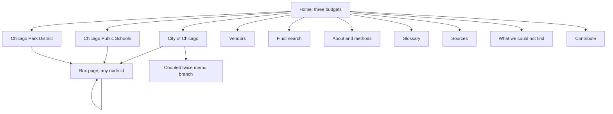

# Website plan: the Chicago 2026 budget explorer

Status: PLAN ONLY (2026-10-03, revision 2 after `research/website_plan_gap_check.md`). Nothing in this document has been built. It describes what to build, in what order, and how to prove it is right. The user has not approved building yet. Every number in this plan was re-read from `data/budget.db` at the build of commit `0aa6a16` (file dated 2026-10-03 12:08, `checks.run_at` 2026-10-03T17:08Z) with the SQL in section 21.4, or from the research files it cites. A data-fix agent was editing the build in parallel, so a few counts differ from the gap check (for example City boxes are 15,420, not 15,403, after four hourly pay-rate boxes were split from position boxes).

Read with: `build/README.md` (the tree), `build/SPLITS.md` (how detail gets added), `research/tree_gap_audit_3.md` (what the data does and does not do), `research/payments_dedupe.md` (the vendor view), `research/midyear_contracts.md` (the 2025 coding caveat), `research/value_context.md` (per resident math and its limits), `research/website_plan_gap_check.md` (the review this revision answers, section 21 maps each finding to its fix).

## 0. One paragraph summary

A static website, no server, built only from `data/budget.db`. Three budgets side by side: City of Chicago ($16,842,553,003.00 net), Chicago Public Schools ($10,253,327,463.68, fiscal year July 2025 to June 2026) and the Chicago Park District ($637,580,350.00). You open a budget and see a handful of big boxes. You tap a box and see the boxes inside it. You keep going until the boxes are small (most of the way to under $1M) or until a box tells you, in one plain sentence, why it cannot be opened further. Every box shows its amount, where the number comes from, what kind of number it is (printed in the budget, a government estimate, our estimate, a leftover, an adjustment, or money already paid, with the period it covers), and any extra facts that go with it. The site never shows a person's name. It says plainly, with two honest figures, how much of each budget reaches a small box and how much does not.

## 1. Goals and non-goals

### Goals

| # | Goal | How we will know |
|---|---|---|
| G1 | A 13-year-old can start at "City of Chicago" and reach a box under $1M without help | Kid usability test (section 15.6): 5 of 6 testers finish task 1 in under 3 minutes |
| G2 | Every box has an amount, a basis, at least one source and (on leaves of $10M or more) a why sentence | Export validator fails the build otherwise (section 13) |
| G3 | Nothing on the site is invented. Every number, date and period traces to a row in `budget.db` | The export is the only data path. No hand-typed numbers in the site code, except UI labels. Periods on "paid so far" boxes come from each box's own source, never from one global date |
| G4 | No individual's name appears anywhere | Pre-deploy leak check (section 13.4) blocks deploy on any hit |
| G5 | Honest about limits: the "counted twice" branch, negative boxes, estimates, leftovers, and the share of dollars that never reach a small box are all visible and explained, using the strict figure (by the box you land on) first | Coverage figures computed by the export from `nodes` (both rules), shown on every budget's front page and on the "What we could not find" page |
| G6 | Fast and cheap: static files, loads in under 3 seconds on a mid-range phone on 4G, hosting under $10 a month | Size budgets in section 11, Lighthouse performance 90 or better |
| G7 | Accessible: WCAG 2.1 AA, full keyboard use, screen reader friendly, color-blind safe | axe-core clean, manual VoiceOver and NVDA pass (section 10) |
| G8 | Open: anyone can check a number against the source, rebuild the database, and send a correction | Public repository (decided, section 20), CI runs the build and validator on every pull request |

### Non-goals (for the first release)

- No live data. The site is rebuilt when the database is rebuilt. No API calls at run time.
- No user accounts, comments, saving or sharing beyond a plain URL.
- No editing the data from the site. Corrections go through the split files and a rebuild (section 20).
- No budget history charts over many years (only the prior year facts already in `side_info`).
- No other governments (CTA, Cook County, City Colleges, CHA). The site says why they are missing.
- No ranking of "good" or "bad" spending. The site shows numbers and sources, not opinions.
- No Spanish or other translations at launch, unless the user decides otherwise (open question 6). The UI will be built so translation is possible later.

## 2. Audiences

| Audience | What they want | What the design does for them |
|---|---|---|
| A 13-year-old (the design target) | Understand where the money goes without jargon | Kid-friendly box names (already in `nodes.name`), one idea per screen, glossary words highlighted, amounts in words ("$2.1 billion") with the exact figure one tap away |
| Parents, teachers | Find their school, park or neighborhood service | Search by school (640 CPS school boxes), park (230 park boxes), department |
| Reporters, watchdogs, City Council staff | Check a number against the source, see vendors and payments, download data | Source link on every box, official name in the details, vendor pages, exact cents, JSON download per box |
| City, CPS and Park District staff | See how their line was split, and object if it is wrong | Basis badge and method note on every estimate, a "report a problem" link with the box id that opens a pre-filled issue |
| Contributors (section 20) | Fix a number or add detail | Public repository, split files, CI that checks their change the same way the maintainer does |
| Screen reader and keyboard users | Same content, same depth | Every tile is a real link in a list, a table view mirrors every box view |

## 3. What the data gives us (facts the design must fit)

From `data/budget.db` (65.2 MB, build of commit `0aa6a16`):

| Fact | Value |
|---|---|
| Boxes (`nodes`) | 47,360: City 15,420 (of which 238 in the `city-twice` memo branch, so 15,182 City proper), CPS 24,894, Parks 7,046 |
| Leaves | City 11,975 (11,842 City proper plus 133 in the memo branch), CPS 20,141, Parks 6,124 |
| Parents (boxes you can open) | 9,120 |
| Boxes with exactly one child | 567, all with the same amount as the child. 290 of them have a leaf as the only child. 27 chain into a second one-child box (longest chain 3) |
| Boxes with 51 to 200 children | 17 (largest: an O'Hare organization unit with 175, CPS charter schools 121) |
| Parents with a negative total | 5: `cps.citywide.set-asides.u12670.salaries` (-$110.9M, 9 children) and two of its children (-$100.5M, -$24.2M), `cps.pensions.claims` (-$4.8M), `parks.utilities-benefits-and-shared-costs.610000` (-$5.3M) |
| Parents with a zero total | 2 (the Parks South Region special recreation fund, 6 children all $0, and one box under it) |
| Parents with mixed-sign children | 608. In 603 the positive children add up to more than the parent. In 4 they add up to more than twice the parent |
| Max depth | City 9, CPS 8, Parks 6. City has 9,584 boxes at depth 7 to 9 |
| Side facts (`side_info`) | 13,880 rows on 11,144 boxes, 116 distinct `kind` values, 150 distinct `period` strings, 20 distinct `basis` values. 4,591 rows sit on 2,724 parents |
| Negative boxes | City 260, CPS 23 (4 are parents), Parks 411 (1 parent). Families: 212 City vacancy savings boxes, 14 "paid beyond the line" boxes (-$181,025,567.64, largest -$151,741,708.64 for police settlements), the -$116,988,502 OBM adjustment, 118 negative Parks rounding boxes (there are 274 rounding boxes in all, 156 positive, none over $3.00) |
| Count x rate boxes | 12,079 have `count` set (12,074 above zero, 5 at zero, 1,244 fractional FTE counts, 11 with no `unit_amount_cents`). 11,705 satisfy count x unit = amount within $1; 363 do not (section 5.5) |
| Box ids | lowercase letters, digits, dots and dashes only (`^[a-z0-9.-]+$`, 0 exceptions), longest 274 characters, 79 longer than 255, 125 longer than 250, longest single dot segment 73. Every `parent_id` is the id with its last dot segment removed (0 exceptions) |
| Distinct source JSON values | 3,662 on boxes, 297 on side facts. 24,861 box sources and 2,424 side sources carry a `file` key (24,596 and 2,235 of them under `raw/`, 289 under `data/`). 3,208 box sources and 3,918 side sources have no `url` |
| Em dashes in names, notes, why sentences, sources, extra or side labels | 0 |
| Largest subtree | `cps.schools` holds 21,569 boxes. The CPS Independent Schools network has 45 children and 1,785 boxes under it, no child subtree larger than 48 boxes |

Basis values in use on boxes: `budget` (33,086), `tied` (10,774), `paid_to_date` (1,618), `proxy` (785), `adjustment` (554), `residual` (324), `gov_estimate` (219, City only). `paid_to_date` is City 1,568 and CPS 50; Parks has none.

Periods behind `paid_to_date` boxes (read from each box's `source`):

| Period | Boxes | What they are |
|---|---:|---|
| January 1 to September 28, 2026 (City payments dataset `s4vu-giwb`) | 1,552 | City vendor, contract, vendor group, month, piece and individuals boxes |
| 2026 through July 31 (Law Department judgment and settlement report, unaudited) | 16 | City settlement groups, $242,511,411.49 |
| CPS fiscal year 2026 (July 2025 to June 2026), supplier totals not tied to a budget line by CPS | 38 | 15 utility and large supplier boxes ($143.6M) and 23 nonpublic special education school boxes ($11.9M) |
| CPS fiscal year 2026, capital project spending | 12 | ITS project pieces, $38.0M |

Coverage (share of absolute leaf dollars by the size of the box where clicking stops, City proper without the memo branch). Two rules, both computed by the export from `nodes`:

| Government | Rule | Under $1M | $1M to $10M | $10M or more |
|---|---|---:|---:|---:|
| City | Strict (by the box you land on) | 9.7% | 20.9% | 69.4% |
| City | Build rule (each budgeted position counts as its own small box) | 42.2% | 14.2% | 43.7% |
| CPS | Strict | 21.0% | 35.6% | 43.4% |
| CPS | Build rule | 57.7% | 15.2% | 27.1% |
| Parks | Strict | 32.8% | 41.5% | 25.7% |
| Parks | Build rule | 48.5% | 33.9% | 17.5% |
| Counted twice (memo) | Strict | 0.6% | 5.6% | 93.7% |

The build rule is what `checks.depth` and `build/treelib.depth_report` compute: a leaf with `count` set and `unit_amount_cents` under $1M is bucketed as under $1M whatever its total. The strict rule uses each leaf's own amount. The gap check (and audit 3) showed the first draft of this plan had the two labels swapped. The site leads with strict, because strict is what a visitor experiences when clicking, and prints the build rule as a second sentence. The export asserts its build-rule figure equals `checks.depth` to four decimals (verified today: City 0.4218 / 0.1415 / 0.4367).

Useful `extra` keys the site uses (whitelist in section 13.2): `official_name` (29,170 boxes), CPS `money_comes_from_cents`, `program_areas_cents` and `budget_lines` (17,855 each), `fte` (2,844), `fte_2025` (2,180 Parks positions), `enrollment_2024_25` (620 schools), `park_number` and `region` (230 parks), `midyear_contract` (492) and `midyear_group` (85), `also_on_other_lines` (75), `titles_in_group` (1,137 pooled CPS titles), `printed_total_cents` (276 Parks), `ward` and `pdf_url` (131 CPS capital projects), bond fields (`principal_cents` and `interest_cents` 60, `fixed_rate` and `final_maturity` 34, `series` 26, `coupon_percent` 10), `contract` (1,236), `contracts` (205), `payments` (1,222), `status` (217). Internal keys dropped: `build_id` (5,009), `inv_path` (3,131), `via` (1,845), `file` (3).

Reconciliation the site must state: City net $16,842,553,003 + "counted twice" $1,709,026,955 + the unexplained OBM adjustment $116,988,502 = gross ordinance $18,668,568,460, to the dollar.

The memo branch `city-twice` has `gov = 'city'` in the database. The export treats it as a fourth root everywhere (counts, coverage, gaps, search facets) and the manifest says so, so no City headline figure includes its 238 boxes, 133 leaves, 30 big leaves or $1.7B. City proper has 310 leaves of $10M or more.

## 4. Information architecture and page list



| Route | Page | Built from |
|---|---|---|
| `/` | Home. Three cards with totals in words, a one-line "what is a budget" intro, search box, links to About and Glossary | `nodes` roots, manifest coverage |
| `/city`, `/cps`, `/parks` | Budget front page: the root box page plus a coverage strip with both figures ("10 cents of every City dollar reach a box under $1M by the box you land on; 42 cents if each budgeted position counts as its own small box") and, for the City, the "counted twice" card. The CPS front page says once that the CPS budget is for the fiscal year July 1, 2025 to June 30, 2026 (24,879 CPS sources name FY2026) | root node, manifest, `city-twice` root |
| `/city/box/<id>` and the same for cps and parks | Box page. The core of the site (section 5). The id is the `nodes.id` | chunk JSON |
| `/city/counted-twice` | The memo branch, framed as "money that moves between City funds, shown so the gross figure adds up, not part of the $16.84 billion" | `city-twice` subtree |
| `/vendors` | Companies paid by the City: 2026 so far (through 09/28/2026, partial year) and 2025 | vendor nodes and payment side facts (section 7) |
| `/vendors/<slug>` | One vendor: which boxes it appears in, payments by year, contract numbers | same |
| `/find` | Search results page (also an inline search in the header) | search index JSON |
| `/jobs` | Job titles across the three governments: budgeted positions and rates, no names, 2025 actual pay by title where every count in the group is 5 or more | job title nodes and `pay_2025` side facts |
| `/schools` | All CPS school boxes with enrollment and budget per student | `kind = school` nodes, `enrollment` side facts |
| `/parks-list` | All 230 Park District park boxes by region | `kind = park` nodes |
| `/about` | About and methods | hand-written, numbers pulled from the export manifest |
| `/glossary` | Words a 13-year-old will meet, each in one or two sentences | hand-written |
| `/sources` | Every document and dataset used, with links where known, grouped by government, with the number of boxes that cite each | distinct `source` JSON without `file` |
| `/gaps` | "What we could not find": the ranked dead ends, both coverage tables, what it would take | leaves of $10M or more from `nodes`, plus hand-written context from audit 3 |
| `/contribute` | How to report a wrong number, how the data is built, link to the repository and CONTRIBUTING (section 20) | hand-written |
| `/box/<id>.json` | Raw JSON of one box, its children and side facts, for anyone who wants the data. Written for parents of $1M or more (4,606 files, open question 11) | export |
| `/404` | Friendly not-found with search | |

Header on every page: site name, the three budgets, Find, About. Footer: data build date and commit, the list of "paid so far" periods in use (not one date), link to Sources, link to Contribute, link to report a problem (GitHub issue, pre-filled with the box id; decided with open question 8).

## 5. The core interaction: opening boxes

### 5.1 Choice: one level of nested boxes at a time

Three options were considered.

| Option | Good | Bad | Verdict |
|---|---|---|---|
| Zoomable treemap (all levels at once, zoom in and out) | Shows proportion everywhere, looks impressive | Hard on phones, tiny labels, negative amounts cannot have area, confusing for kids, poor for screen readers | No |
| Plain list with indent (like a file tree) | Simple, accessible, works everywhere | Loses the feeling of "how big is this compared to that", which is the point of the site | Use as the alternate view |
| **One level of nested boxes** (the current box is a container, its children are tiles sized by amount, tap a tile to make it the container) | Proportion is visible, one idea per screen, each tile is a plain link, works on phones as a stacked list | Needs rules for many children, negatives, negative and zero parents | **Yes, recommended** |

How a box page looks, top to bottom:

1. **Breadcrumb trail**: "City of Chicago > Keeping people safe > Chicago Police Department > Overtime". Each crumb is a link. On phones the trail collapses to "... > Chicago Police Department > Overtime" with a tap to expand. The names come from the `path` array every exported record carries (section 11.2), so a deep link at depth 9 never needs a second fetch for its trail.
2. **The box header**: name in large type, amount in words ("$211.6 million"), the basis badge (with its period when the basis is "paid so far"), and one line of context ("1 of 7 boxes inside Chicago Police Department, 10% of it"). Below it, the note from `nodes.note` if there is one, and for leaves the why sentence. For a one-child chain the header shows every collapsed name (section 5.4).
3. **The tiles**: children drawn as a squarified treemap in a fixed-height area (about 60% of the viewport height on desktop, a stacked list of bars on screens narrower than 640 px). Rules:
   - Up to 20 tiles are drawn. If a box has more than 20 children, the 19 largest are drawn and the rest become one tile "N smaller boxes" that opens an inline list sorted by amount (this covers the 17 boxes with 51 to 200 children and the 111 "Other vendors" groups).
   - A tile shows the name (clipped to two lines, with the full name on focus and in the list view), the amount in words, and a small basis badge. Tiles too small for text show only a color and get their text in the list below.
   - Tiles are `<a href>` links inside a `<ul>`, styled as tiles, sorted by amount, so keyboard and screen reader order is the same as visual size order, and a tile can be opened in a new tab, copied, or announced as a link (gap check item 20).
   - Negative children are never drawn as tiles (area cannot be negative). They go in a separate strip under the treemap (section 6.2).
   - Rounding boxes (`kind = rounding`, 274 Parks boxes, none over $3.00) are never tiles. They appear as one footer line in the list view, "plus rounding of $X", with the sign, and the equation still ties to the cent.
   - **Share of parent.** The "N% of it" line divides by the parent's amount. When the positive children add up to more than the parent (603 parents, because negative siblings pull the total down), shares are shown against the sum of the positive children instead, and the header says "shares are of the boxes that add money, before the boxes that take money away". This keeps every share at or under 100%.
   - **Negative parent** (5 boxes). The page is reached from the negatives strip of its own parent. The equation (section 6.2) is shown first, then tiles sized by absolute value, each marked with its sign, and the header says "This box is negative. It takes money away from the box above."
   - **Zero parent** (2 boxes). No tiles. The list view only, with the sentence "Every box inside this one is $0 in the 2026 budget."
4. **"Also shown as a list"**: a table under the tiles with name, amount, share, basis, and an "open" link. This is the same data as the tiles and is always present (not hidden behind a toggle), because it is the accessible version and the place where long names can be read in full.
5. **Side facts** (section 6.3), **sources** (section 6.4), and a small **"Get this box as JSON"** link (on boxes that have the file, section 4).
6. **Up one level** button at the bottom, mirroring the breadcrumb.

### 5.2 Mobile first

- Designed at 360 px wide first. Tiles become a vertical list where each row has the name, the amount, and a horizontal bar whose length is the share of the parent. Tapping a row opens it.
- Tap targets at least 44 x 44 px. Amount and name both tappable.
- No hover-only information. Anything in a tooltip is also in the list view.
- Sticky header with the breadcrumb's last crumb and a back arrow.

### 5.3 Deep links, back and forward

- Every box has a stable URL: `/<gov>/box/<node id>`. The id is URL safe (letters, digits, dots, dashes; longest 274 characters, well under browser limits). Static file names are a separate matter, handled in section 11.3.
- The browser back button always goes up one step in the user's history, not one level in the tree (history API, no hash routing).
- The "Up one level" button goes to the parent.
- Sharing a link opens that box directly, with its breadcrumb trail filled in from the record's `path` array (no extra fetch).
- If an id does not exist (old link after a rebuild), show the nearest existing ancestor with a notice "This box was renamed or moved in the latest build. Here is the box that contains it." This works because every id's parent is its dot-prefix (verified, 0 exceptions). The client walks the id's prefixes against the manifest's chunk index to find the longest one that exists.
- Ids that embed a count break on every refresh. The 111 `vendor_group` ids used to end in `other-vendors-<N>` where N was the number of vendors pooled, with 760 children under them. Fixed in the build in commit `6da727d`: the id is now `other-vendors`, the count stays in the name and in `extra.n_vendors` (0 ids match `other-vendors-<digits>` today). The validator keeps the check so no future id is built from a count (13.3).

### 5.4 Collapsing boxes with one child

567 boxes have exactly one child with the same amount. Opening them is a wasted tap. Rule: when a box has one child, the box page shows the child's page, whatever the child is. If the child is a parent (277 cases), its children are the tiles. If the child is a leaf (290 cases), the leaf's page is shown (its why sentence, side facts and sources) with no tiles. Chains are walked to the end (27 boxes chain into a second one-child box, longest chain 3). The header lists every collapsed name in order ("Firemen's retirement fund > Extra payment above what the law requires"), each with its own badge if the bases differ. The intermediate boxes keep their own URLs, which redirect client-side to the end of the chain. The export writes a `collapse_into` pointer on each one-child box that points to the end of the chain, and the breadcrumb shows the chain as one crumb with a "+N" marker that expands.

### 5.5 Reading amounts

| Amount | Shown as | Exact figure |
|---|---|---|
| $1 billion or more | "$16.84 billion" (two decimals) | Full dollars and cents in the header on tap ("$16,842,553,003.00") and always in the list view and JSON |
| $1M to $1B | "$211.6 million" (one decimal) | same |
| Under $1M | "$406,560" (whole dollars) | cents on tap |
| Negative | "takes away $98.0 million" with a minus sign in the list | same |

Rounded figures in tiles may not add up visually. The list view shows exact cents and a footer row "These add up to the box above, to the cent", which the export validator guarantees.

**Count x rate boxes.** 12,079 boxes carry `count`, `unit_amount_cents` and `unit_label`. The export computes a `formula_kind` for each and the site prints the matching sentence. Nothing is printed that the three fields do not support:

| `formula_kind` | Rule (export) | Boxes today | Sentence on the site |
|---|---|---:|---|
| `exact` | count x unit equals the amount within $1 | 11,705 | "4 positions x $113,568 each" (the unit label as in the data: positions, full-time equivalents, students, hours, and so on) |
| `hourly` | amount / (count x unit) is between 2,070 and 2,090 | 167 (all City, label "positions") | "4 positions at $48.73 an hour (2,080 hours a year each)" |
| `monthly` | ratio between 11.9 and 12.1 | 12 (City, label "positions") | "14 positions at $12,284.13 a month" |
| `about` | not exact, but within 0.5% of the amount | 176 (CPS FTE proxy splits, students, enrolled employees, pension member shares) | "About 38 positions (FTE), about $57,750 each on average" with the word "about" twice |
| `none` | anything else (8 boxes), or `count` is 0 (5) or `unit_amount_cents` is missing (11) | 24 | No formula. The box shows only its amount, and the count as a plain fact ("32 positions") |

The export writes the full table of `about` and `none` boxes to its log so the build can be improved. The four "hours labelled as positions" boxes the gap check found ("166,449 positions x $48.73" and three more) were fixed in the build in commit `ea551cd`; they are now hour boxes and `unit_label = 'hours'` (123 boxes). An hourly box, an `about` box and a `none` box are in the snapshot set (section 15.3).

## 6. Showing basis, negatives, side facts, sources and why

### 6.1 Basis badges

Each basis gets a short label, a one-sentence meaning (used in a tooltip, in the list view and in the glossary), a color, and a shape or pattern so color is never the only cue.

| Basis | Label on the site | Plain meaning | Visual |
|---|---|---|---|
| `budget` | In the budget | This exact number is printed in the budget document. | Solid fill, dark blue, no icon |
| `tied` | Adds up exactly | The government published a list that adds up to this number exactly. | Solid fill, teal, small "=" icon |
| `gov_estimate` | Government estimate | The government published this number as an estimate, not a final figure. | Solid fill, purple, small "~" icon |
| `paid_to_date` | Paid so far ({period}) | Money actually paid out in the period shown, which is not the whole year. The period is the box's own, read from its source (section 6.1.1). | Solid fill, green, check icon, and the period always printed |
| `proxy` | Our estimate | We worked this out ourselves from public data. The note says how. Treat it as rough. | Dashed border, diagonal stripes, orange, "?" icon |
| `residual` | Leftover | What is left of a bigger box after we named everything we could. | Dotted border, light gray fill, "..." icon |
| `adjustment` | Adjustment | A number the budget uses to make totals come out right, often negative. | Hatched border, gray, "+/-" icon |

Rules:

- `proxy`, `residual` and `adjustment` tiles always carry their badge text, even on small tiles, because the user asked that our estimates and leftovers be unmistakable.
- A `proxy` box must show its method note (`nodes.note`) directly under the header, not behind a tap. Two groups have no note today:
  - 248 CPS proxy boxes with an `fte` count in `extra` (`unit_label = 'positions (FTE)'`). The site prints a sentence built only from the data: "Our estimate: this title's share of the line, split by its N full-time positions."
  - The gap check found 11 City proxy boxes ($615,328,088) with no note: three CDOT state grant construction pieces and eight employee health boxes of the form "N enrolled employees x $R". Fixed in the build in commit `23b73f7` (0 City proxy boxes without a note today). The export still carries a fallback sentence for any future proxy box without a note ("Our estimate. The build did not record how this was worked out; see the box above.") and the validator lists such boxes as warnings so they cannot be forgotten.
- Every budget front page has a one-line legend linking to the glossary.

#### 6.1.1 Periods on "paid so far" boxes

One global cut-off date is wrong for 66 of the 1,618 `paid_to_date` boxes (section 3). The export gives every `paid_to_date` box a `period` field, derived from the box's `source` and checked against a short list of known periods. Any box whose source does not match a known period fails the build (not a warning), so a new source can never silently inherit another period's date.

| Period key | Matched on | Label printed in the badge and the equation | Boxes |
|---|---|---:|---:|
| `city_2026_to_0928` | source `name` contains "Jan 1 to 09/28/2026" or dataset `s4vu-giwb` with that string | "Jan 1 to Sep 28, 2026, partial year" | 1,552 |
| `city_law_2026_to_0731` | source `doc` contains "through 2026-07-31" | "Jan 1 to Jul 31, 2026, partial year, unaudited" | 16 |
| `cps_fy2026_vendor_total` | source `doc` contains "supplier payments FY2026" | "CPS fiscal year 2026 (Jul 2025 to Jun 2026), vendor total" | 38 |
| `cps_fy2026_capital` | source `doc` contains "Capital Expenditures" and "FY2026" | "CPS fiscal year 2026 (Jul 2025 to Jun 2026), project spending" | 12 |

The 38 CPS vendor-total boxes also carry a caveat badge "Vendor total, not tied to a budget line by CPS", shown the same way as the 2025 coding caveat (section 6.6), because every one of their 38 notes begins "Vendor total paid by CPS in FY2026" and the source names say "not tied to budget lines" or match the vendor by name to the State Board's directory. Whether they should keep the same green "Paid so far" badge as the City's line-matched payments or get a distinct "Paid in FY2026 (vendor total)" badge is open question 17 (recommended: same badge family, different period text plus the caveat, so the glossary has one entry for "paid so far").

The manifest lists every period key in use with its label and box count. The footer prints them all ("Paid so far figures cover: City payments Jan 1 to Sep 28, 2026; Law Department settlements through Jul 31, 2026; CPS fiscal year 2026"). Nothing prints a date that is not in that list.

### 6.2 Negative boxes

Negative boxes are shown, never hidden. Under the treemap, a strip titled "Boxes that take money away" lists each negative child with its amount, badge and note. Above the strip, a one-line equation shows how the parent total is reached. For the Police Department's Corporate Fund "Salaries and Wages - on Payroll" line (`city.public-safety.chicago-police-department.pay-for-workers.0100-corporate-fund.0100-1005-0005`): "Boxes above add up to $1,536.8 million. Minus $98.0 million of budgeted turnover (vacancy savings). Equals $1,438.8 million." (Real figures from the database: positives $1,536,786,812, negative -$97,986,868, parent $1,438,799,944.) The numbers are computed from the children at export time and checked.

The same equation is the first thing on the page of a negative parent (5 boxes) and is how a visitor understands a parent whose positive children exceed it (603 boxes, section 5.1 rule on shares).

The three families of negative boxes get their own plain explanations in the glossary, linked from the strip:

- Vacancy savings (212 City boxes, CPS vacancy factor, Parks vacancy allowance): "The budget assumes some jobs will be empty for part of the year, so it subtracts the pay that will not be spent."
- Paid beyond the line (14 City boxes, -$181,025,567.64, largest police settlements -$151,741,708.64): "More has already been paid this year than the budget set aside. The negative box keeps the total honest."
- Adjustments the budget office makes (-$116,988,502): "The City's own total is lower than its lines add up to. No document explains the difference. We show it as its own box rather than hide it."

Rounding boxes (274 Parks boxes, `kind = rounding`, 118 negative and 156 positive, none over $3.00, one per parent) never become tiles and never go in the negatives strip. They are a footer line in the list view: "plus rounding of $X in the printed budget". (The first draft said they would be grouped into one tile when they share a parent. They never share a parent, so that rule never fired.)

### 6.3 Side facts

`side_info` rows are facts attached to a box that are not added into its amount. The site always introduces them with the sentence "These facts go with this box. They are not added into the amount above." They are grouped into sections by `kind` and then by `period`, because the same kind covers different years. The export carries a kind-to-section map, and any kind not in the map lands in "More facts" so nothing is dropped.

| Section title on the site | Kinds (examples) | How it is shown |
|---|---|---|
| Paid so far (one sub-table per period) | `vendors_paid` (41 rows, City, Jan 1 to 09/28/2026), `contract_family_paid_2026` (22, City, 2026-01-01 to 2026-09-28), `paid_to_date` (2 rows: one "2026 to 09/28", one "2025"), `cpd_spend_to_date` (1, "2026 Jan-Aug"), `vendor_payment` where period is FY2026 (117 CPS rows) | Table of payees, amount, payment count, contract number. The sub-table header prints the row's own `period` string. Individuals appear as "Individual (name hidden)" with a neutral description only (section 8) |
| Paid in earlier years | `vendor_payment` where period is 2019 to 2022 (115 Parks rows), `vendor_payment_prior_years` (4 CPS rows, FY2025), `paid_2025_vendors` (1,127 City rows, "2025 invoices") | Table, header "{period}, for comparison only". 114 of the 1,127 `paid_2025_vendors` lists hold the largest 5 of N payees (`n_payees > len(items)`); the table footer says "largest 5 of N payees" whenever that is the case |
| Estimated 2026 share (not in the boxes) | `estimate_2026_multi_line_contracts` (428) | Same table, inside a dashed "Our estimate" frame, with the row's own label (it already starts with "ESTIMATE, not in the boxes") |
| Last year | `prior_year_budget`, `prior_year_actual`, `pay_2025`, `pay_2025_actual` | Two or three numbers side by side: 2025 budget, 2025 actual, 2026 budget, with a small bar. `pay_2025` groups with any count under 5 show counts and budgeted figures only (section 8) |
| People and students | `enrollment`, `retirees`, `active_payroll`, `health_enrollment_basis` | Count cards: "4,069 students enrolled (2024-25)" |
| Pension facts | `funded_ratio`, `unfunded_liability`, `recommended_contribution`, `gap_vs_recommended`, `amortization_payment`, `amortization_target`, `benefits_paid`, `annual_benefits_in_force`, `member_contributions`, `total_normal_cost`, `advance_history`, `advance_payment_2026`, `advance_savings`, `projected_payroll` | The pension explainer layout (section 7.3) |
| Loans and bonds | `debt_facts`, `debt_context`, `bond_uses`, `derived_principal`, `iepa_loan`, `iepa_aggregate` | Fact list with the series, rate, final year |
| Projects | `ledger_project`, `capital_*`, `drgr_activity`, `idot_*`, `tip_*`, `faa_*`, `federal_*` | Table of project names and amounts, each row with its own source |
| What the government says | `official_explanation`, `official_plan`, `context`, `budget_overview_cap`, `statute_context`, `revenue_that_pays`, `revenue_context` | Quoted text with the document and page |
| More facts | everything else | Label, amount, period, basis, source |

Each side fact row shows its own `period` string as it is in the data, its `basis` as a badge, and its source link. The 20 side basis values all map to a badge (the first draft mapped 7 and the unit test would have thrown on the rest):

| Side `basis` | Rows | Badge label | Style |
|---|---:|---|---|
| `budget`, `appropriation` | 6,746, 3 | In the budget | as the box badge |
| `tied` | 2 | Adds up exactly | as the box badge |
| `gov_estimate`, `projected`, `projection` | 426, 744, 28 | Government estimate | as the box badge |
| `paid_to_date`, `paid` | 19, 110 | Paid ({period}) | green, check icon |
| `actual` | 4,481 | Actual ({period}) | green, no check icon (a closed year, not a partial one) |
| `proxy`, `implied` | 436, 28 | Our estimate | as the box badge |
| `count` | 620 | A count | neutral gray, "#" icon |
| `published`, `stated`, `approved`, `plan`, `award`, `contract`, `contract_value`, `actuarial` | 113, 26, 54, 10, 7, 10, 14, 3 | Published figure ({basis word}) | neutral gray, document icon. The raw word is printed in the tooltip ("published by the government as: contract value") |

Any side basis not in this table gets the neutral gray badge with the raw word and the validator prints a warning naming it, so a new value never breaks the build or goes unnoticed.

The 171 side facts on `parks.building-and-fixing-parks` are the most on any box, so the sections collapse by default past the first 10 rows. The 22 `vendors_paid` rows whose JSON is over 20 KB (the City root alone carries 4,335 payee items, 890 KB raw) are not inlined in chunks; they are written to `side/<node id>.json` and loaded when the section is opened (section 11.2).

### 6.4 Sources

Every box shows "Where this number comes from" with the source document or dataset name, the page if given, and a link when one is known. The source JSON on boxes carries `doc` or `name`, `dataset`, `url`, `page`, `printed_page`, `line`, `cite`, `url2`, `acfr_url`, `note` and `file`.

Display rules (one function, unit-tested against every distinct source value in the database, 3,662 plus 297):

- Title: `doc`, else `name`, else `dataset`.
- `page` may be an integer (7,038 boxes), a string (155, for example "sheet A, summed by department"), a list (90, for example `[268]`) or absent (40,077 counting nulls). Integers print "page N", lists "pages N, M", strings print as they are.
- `printed_page` (6,988) prints "printed page N" after `page`. `line` (4,092) prints "ordinance line N". `cite` (96) prints as a quotation after the title.
- Links: `url` is the main link. `url2` (4) and `acfr_url` (10) are second links labelled "also" and "financial report".
- **`file` is dropped by the export everywhere.** 24,861 box sources and 2,424 side sources carry a local path under `raw/` or `data/`; none of them are useful to a reader and the validator forbids those strings in the output (section 13.3). The Sources page shows a count of boxes per source instead of "our extract".
- **Sources without a URL.** 3,208 box sources and 3,918 side sources have no `url`. The largest groups: "CPS FY2026 budget positions by unit and job title" (2,844 boxes), `research/city_personnel.md` (122), "2026 Annual Appropriation Ordinance" (120), "Official statements, see data/city_bond_series_2026.json" (87), and 25 others. The export carries a `doc_urls` lookup (a hand-written JSON in `site/content/`) that maps known document titles to their public URL (the ordinance PDF, the CPS budget book and position file, the MEABF valuation, the O'Hare official statement, and so on). A source with no `url` and a lookup match links to the lookup URL. A source that cites a repository file (`research/*.md`, `data/*.json`, 123 boxes plus the 87 bond boxes) links to that file on GitHub, because the repository is public (decided, section 20). A source with neither prints the title with no link and the validator counts it; the count is on the Sources page as "N boxes cite a document we could not link".

Side facts show their own source the same way. The Sources page lists every distinct source (grouped by government and document, deduplicated by URL) with the number of boxes and side facts that cite it.

### 6.5 The why sentence

Every leaf of $10M or more (except `adjustment` boxes) has `why_cant_go_deeper` (validated: 0 missing). The site shows it on every leaf that has one (City 571 including the memo branch, CPS 282, Parks 14) as a highlighted paragraph: "Why you can't open this box: ...". 47 parents also carry a sentence from before they were split (City 24, CPS 21, Parks 2). Rule: show the why sentence only on leaves, never on parents (audit 3 calls those harmless if hidden on parents). Leaves under $10M with no sentence get a short standard line: "This is the smallest piece our data shows." (This states a fact about the data, not a number.)

### 6.6 The 2025 coding caveat on contract boxes

492 boxes carry `extra.midyear_contract = true` and the note "Matched to this line using how the City coded this contract's 2025 invoices." These boxes always show a caveat badge "Matched by 2025 coding" next to the basis badge, and the note is printed on the tile's list row and on the box page header, not only in details. The sibling "Budgeted but not spent yet" box on those lines (120 such remainder boxes in all) is shown with its own why sentence from the data plus the caveat badge, so a reader sees both boxes are built on the same matching. Audit 3 item 3 asks for that remainder sentence to be improved in the build (section 13.6 lists it as a data prerequisite).

The same caveat badge mechanism carries "Vendor total, not tied to a budget line by CPS" on the 38 CPS vendor-total boxes (section 6.1.1).

The `also_on_other_lines` note (75 boxes) is shown as a warning line: "This project also has boxes on other lines. Do not add them up." with the list.

## 7. Paid so far, vendors and pensions

### 7.1 "Paid so far" as boxes

Boxes with basis `paid_to_date` are regular tiles (green, check icon). Their parent line shows the equation: "Budget for this line $X. Paid so far $Y ({period}). Budgeted but not spent yet $Z." The period in the equation is the box's own (section 6.1.1), never a global date. If Y is larger than X the negative "Already spent more than the budget" box appears in the negatives strip with its explanation (13 boxes with that name plus the police settlements box, the 14 "paid beyond the line" boxes). The words "partial year" and the period appear every time a 2026 payment figure is printed. The site never shows a projected full-year figure.

### 7.2 Vendor view

Requirement: the site is built only from `budget.db`. Vendor facts in the database today are attached to boxes: 1,568 City `paid_to_date` boxes (889 vendor, 538 contract, 111 vendor group, 27 piece, 16 settlement group, 8 month, 6 individuals), 1,127 `paid_2025_vendors` side facts (one per line), 428 `estimate_2026_multi_line_contracts` side facts, 232 `vendor_payment`, 41 `vendors_paid`, 22 `contract_family_paid_2026`, plus 50 CPS `paid_to_date` boxes (23 of them `kind = vendor_payment`). About 4,773 distinct payee names appear in the side facts. There is no vendor table.

Plan:

1. **Data prerequisite (a build change, small):** add a `vendors` table to `budget.db` in `build/city_tree.py` (or a new `build/vendors_table.py` run by `build_all.sh`) from the deduplicated payment files that already feed the tree, with one row per (payee, year, contract): `payee_display` (business name or "Individual (name hidden)", decided by `build/payee.py`), `is_individual`, `period` (the same period keys as section 6.1.1, plus `city_2025`), `amount_cents`, `n_payments`, `contract_number`, `department`, `linked_node_ids` (JSON). The same privacy scan that runs on `nodes` and `side_info` runs on this table. This keeps the site inside the "only from budget.db" rule and avoids the site code inventing vendor totals by adding up side facts, which would double count the proxy estimate rows.
2. `/vendors`: table of business payees, columns "Paid in 2026 so far (Jan 1 to Sep 28, partial year)" and "Paid in 2025 (full year)", sortable, searchable, with the dedupe note from `research/payments_dedupe.md` summarized in one sentence and linked. Individuals are pooled into one row "Individuals (names hidden), N payees" per year with the total, so the dollars are not lost. Individuals never get a vendor page and are never in the search index.
3. `/vendors/<slug>`: one business, both years, contract numbers and descriptions, the boxes in the tree it appears in (with the 2025 coding caveat badge where it applies), and the plain sentence "A 2026 figure is nine months of payments. Do not compare it to a 2025 full year without noticing that." The slug is built from the payee name only, never from a count or an amount, so it survives a refresh.
4. Never annualize. No "on track for" figures anywhere.

If the user does not want the build change, the fallback is a vendor list derived only from `paid_to_date` boxes and the actual-payment side kinds (excluding the proxy estimate kind), with a clear note that it is "payments we could place on a budget line", which is a smaller set. Open question 9.

### 7.3 City pensions, as rich as the data allows

The four City funds (`city.retirement.*`) have a consistent shape: contribution line, split into "Cost of pensions workers earn this year" (tied) and "Paying down the shortfall (money promised but never saved)" (proxy), plus the advance contribution line, and 66 side facts across the four funds. Build a pension layout used whenever a box's id starts with `city.retirement.` and the box is a fund or a contribution line:

- A headline strip from side facts: funded ratio ("27.42% funded" for MEABF, with the asset and liability figures from the label), unfunded liability, recommended versus statutory contribution and the gap, and the 2058 target from `amortization_target`.
- "Who the fund pays": the `retirees` count x average items as cards ("21,874 retired members, average $49,104 a year"), which are group figures from the fund's valuation, not individuals.
- "Who pays in": `active_payroll` (and Tier 1 and Tier 2 for Police), `member_contributions`.
- "Extra payments": `advance_history` as a small timeline and `advance_payment_2026` and `advance_savings`.
- "Paid in 2025": `benefits_paid` with its breakdown text.
- The normal treemap of the fund's boxes under the strip.

CPS (`cps.pensions`) and Parks (`parks.retirement-pensions`) use the same layout with whatever side facts exist (CPS has the pension reserve proxies, Parks has two boxes). The layout only renders cards for kinds that exist; it never shows a placeholder number.

## 8. Privacy rules the site enforces

| Rule | Where enforced |
|---|---|
| No individual names anywhere | Build (`build/payee.py`, roster scan) and pre-deploy leak check on the final `dist/` files |
| Payments to individuals show as "Individual (name hidden)" | Already in the data. The site must not alter this string. The three "Payments to N individuals (names hidden)" box names are also allowed by the validator's exact-string check |
| Individuals' payment descriptions | Fixed in the build in commit `d88fb53`: every `is_individual` item in `vendors_paid` now carries only one of 7 neutral descriptions ("Payment to an individual (judgments, claims or outside counsel)" and so on, 10,035 items), and `verify_db.py` fails on anything else. The export keeps that text, blanks any `contract` number on individual rows (118 carry one today), and the validator asserts no `is_individual` row has a description outside the neutral list. Open question 18 asks whether to keep the neutral category or blank it entirely (recommended: keep it, it carries no identity) |
| Business names shown | As in the data. 855 of the 1,427 vendor and contract box names are ALL CAPS as in the source; the site may apply title case for display with the original in the details (nice to have, not required) |
| Job titles: totals only, groups under 5 people get no averages or totals of actual pay | Export, on every `pay_2025` side fact. The fields live under `extra.group.*`. The rule: for each count field under 5, drop the dollar and statistic fields it describes, listed below. Keep every count, `dept`, `title`, `title_code`, `vacancy_*`, and the `budget_2026_*` figures (which are printed in the ordinance). Today 558 of 2,329 rows have at least one count under 5 (`n_paid_2025` 165, `n_current` 350, `n_paid_2024` 304, `n_paid_primary` 313, `n_total_excl_retro_fullyear` and `n_regular_fullyear` 484 each); 152 rows carry 282 non-zero dollar or statistic values next to a count under 5 that the first draft's rule (165 rows by `n_paid_2025` or `n_current` only) would have shipped. The validator asserts no dollar or statistic field survives next to its count under 5. `pay_2025_actual` (13 rows) is already pooled and has 0 groups under 5 |
| Budgeted rates for small groups | Budget boxes like "1 positions x $90,732" stay, because that is a budgeted rate for a position from the public ordinance, not a person's actual pay. 6,557 City job-title and pay-rate boxes and 2,057 Parks position boxes have a budgeted count under 5 (4,461 City boxes have a count of 1). CPS titles under 5 in a unit are already pooled as "Other job titles (fewer than 5 positions each)" (1,137 boxes). Whether the under-5 rule should also apply to budgeted rates is open question 16 (recommended: no, they are public ordinance figures and hiding them would remove 8,614 boxes from the tree) |
| Only `budget.db` ships | The export reads one file. `data/people/`, `raw/`, `data/*.json` are never opened by site code. The export drops `source.file` and `extra.file` so no local path reaches the output, and the leak check also fails if any path under `data/people` or `raw/` appears in `dist/` |
| Search never lists an individual | The search index builder skips any record with `is_individual` or a name containing "name hidden" (validator check) |
| Pre-deploy leak check | Section 13.4 |

Field map for the under-5 rule (`extra.group`):

| Count field | Dollar and statistic fields dropped when the count is under 5 |
|---|---|
| `n_paid_2025` | `regular_2025`, `overtime_2025`, `other_premium_2025`, `retro_lumpsum_2025`, `total_2025` |
| `n_paid_2024` | `total_2024`, `overtime_2024` |
| `n_current`, `n_current_annualized_base` | `median_current_annualized_base`, `mean_current_annualized_base`, `p90_current_annualized_base` |
| `n_total_excl_retro_fullyear` | `median_total_excl_retro_fullyear`, `mean_total_excl_retro_fullyear`, `p90_total_excl_retro_fullyear` |
| `n_regular_fullyear` | `median_regular_fullyear`, `mean_regular_fullyear`, `p90_regular_fullyear`, `mean_overtime_fullyear`, `mean_other_premium_fullyear`, `pct_with_overtime_fullyear` |
| `n_paid_primary` | no dollar field of its own; kept as a count |

A row where a count is under 5 shows "Fewer than 5 people, so no pay figures are shown" in place of the dropped values. The fixture database (section 15.2) has one row for each count field under 5, including the `n_paid_2024` case with a 2024 total.

The two person-named $6,000 boxes that audit 3 found were fixed in commit `aaae712`. The leak check will catch any return.

## 9. Search

One search box in the header, one results page at `/find`. Client-side, no server.

| What you can find | Index source | Rows (approx.) |
|---|---|---|
| Any box of $1M or more | `nodes` with `abs(amount_cents) >= 100,000,000`, memo branch faceted separately | 8,020 |
| Departments | `kind` in department, org_unit (City 74, CPS 102, Parks 46 departments, 647 org units) | about 870 |
| Schools | `kind = school` | 640 |
| Parks and venues | `kind` in park, venue, institution | 256 (230 parks, 14 venues, 12 institutions) |
| Job titles | distinct names of `kind` in job_title, job_title_group, position | 1,672 |
| Vendors (businesses only) | `vendors` table (section 7.2) or vendor boxes | 1,123 distinct names on 1,427 vendor and contract boxes today, 4,773 distinct payees in side facts |
| Glossary words | hand-written | about 60 |

Design:

- The index is a JSON file per government plus one for vendors, loaded on first keystroke (a trimmed index of about 14,000 rows is about 0.3 MB gzipped, measured on today's data).
- Search runs in the browser with a small fuzzy matcher (for example MiniSearch or Fuse.js, both under 10 KB gzipped). Prefix and typo-tolerant, so "polce" finds Police.
- Results show the name, the amount, the basis badge, and the breadcrumb path (from the record's `path`), because the same name appears many times ("Other job titles (fewer than 5 positions each)" appears 1,137 times and is useless without its unit). Grouped by type (Departments, Schools, Boxes, Vendors, Jobs, Words). The 158 boxes with no `kind` are exported as `kind = 'box'` so facets never skip them.
- Results are a list of links, keyboard navigable, announced to screen readers ("12 results").
- Search never indexes anything hidden by the privacy rules, because it is built from the same exported JSON, and the validator checks that no entry is an individual.

## 10. Accessibility (WCAG 2.1 AA)

| Need | What we do |
|---|---|
| Keyboard | Every tile is an `<a href>` in a `<ul>`; Tab order is size order; Enter opens; Escape goes up one level (no Backspace binding, it fights the browser and the search field); a visible "Up" button always exists; a skip link jumps to the tiles; focus is moved to the box header after navigation and announced |
| Screen readers | Each tile's accessible name is "Name, amount, basis, share of parent" (for example "Overtime, 211.6 million dollars, in the budget, 10 percent"); the list view is a real `<table>` with headers; the treemap region has `aria-label` and the list is marked as the alternative; live region announces "Now inside Chicago Police Department, 7 boxes" |
| Color-blind safety | Basis is shown by label text and pattern or icon as well as color; the palette is checked with a deuteranopia and protanopia simulator; negatives use a hatch pattern plus a minus sign, not red alone |
| Contrast | 4.5:1 for text, 3:1 for tile borders and icons; text on tiles sits on a solid label background, not directly on the fill |
| Motion | No animation when `prefers-reduced-motion` is set; the treemap transition is a simple fade, under 200 ms |
| Zoom and reflow | Works at 400% zoom and 320 px wide (tiles become the list) |
| Reading level | UI text written for a 13-year-old, checked with a readability tool at grade 7 or lower; box names come from the data |
| Touch | 44 px targets, no hover-only content |
| Language | `lang="en"`, and a `lang` attribute on any Spanish content if translation is added later |
| Testing | axe-core on every page type in CI, Lighthouse accessibility 100, a manual VoiceOver (Safari, iOS) and NVDA (Firefox, Windows) pass of the box page, search, vendor page and glossary before launch |

## 11. Performance with 47,360 boxes

### 11.1 Measurements on today's data (build `0aa6a16`, Python `json.dumps` with compact separators, gzip level 6)

- The spine (all 1,674 boxes at depth 3 or less): trimmed records (id, parent, name, amount, basis, kind, is_leaf, n_children, depth, chunk) 43 KB gzipped; full records without side facts 74 KB; full records with side facts 363 KB. The first draft's "94 KB, full records" was measured without side facts and would have blown the 100 KB budget once side facts were included.
- Side facts are lumpy: 22 `vendors_paid` rows have JSON over 20 KB raw (together 3.2 MB raw, 211 KB gzipped). The City root's two rows alone are 890 KB raw (4,335 payee items). `pay_2025` is 2,329 rows and 2.6 MB raw but spread evenly.
- Chunking by box count does not work: the CPS Independent Schools network (1,785 boxes under 45 children, no child subtree larger than 48 boxes) is one chunk at any count threshold from 150 to 300, 104 KB gzipped on its own and 148 KB with the repeated source JSON inlined.
- Chunking by estimated bytes works. Rule: a box becomes a chunk root when its subtree's estimated raw bytes exceed a limit; sources are replaced by an index into a shared `sources.json` (3,662 distinct sources, 27 KB gzipped); side rows over 20 KB are moved to `side/<id>.json`. Results:

| Raw limit per subtree | Chunks | Median gz | 90th pct gz | Largest gz | Chunk roots on the path to a leaf (median / max) |
|---|---:|---:|---:|---|---|
| 600 KB | 48 | 49 KB | 73 KB | 219 KB (`cps.schools.district-run`, 5,485 boxes) | 3 / 6 |
| 400 KB | 68 | 38 KB | 68 KB | 78 KB (DFSS, 1,365 boxes) | 4 / 7 |
| **300 KB** | **85** | **27 KB** | **59 KB** | **73 KB** (`city.finance-and-administration`, 1,023 boxes) | **4 / 7** |

- The total of all chunks is 2.4 MB gzipped at any of those limits, so the whole tree is cheap; only the per-chunk size matters.
- A "wide parent" whose own children do not fit is handled by the same rule: `cps.schools.district-run` at 600 KB is the one case where a parent's direct children (networks) are all under the limit but the parent's subtree is 219 KB gzipped. At 300 KB each network becomes its own chunk root. If a future build adds a parent with hundreds of mid-size leaves, the export falls back to paging that parent's children into `chunks/<id>.p2.json` and so on, and the validator fails if any chunk is over the budget.

### 11.2 Design

| Piece | What it holds | Budget (gzipped) |
|---|---|---|
| `manifest.json` | Build commit and time, totals, coverage (both rules, per root including `city-twice`), the list of paid-so-far periods with labels and counts, chunk index (chunk root id to file name), file counts | 20 KB |
| `spine.json` | Every box at depth 3 or less as trimmed records: `id, parent_id, name, amount_cents, basis, kind, is_leaf, n_children, depth, chunk`. No side facts, no sources. Side facts and sources for a depth 3 box come from its chunk | 60 KB (43 KB today) |
| `chunks/<root id hash>.json` | One subtree, cut by estimated bytes (300 KB raw). Full records with `path` (the names of all ancestors, so breadcrumbs need no other file), `source` as an index into `sources.json`, inline side facts under 20 KB, and `side_ref` for larger ones. Children of a cut point are listed as stubs (id, name, amount, basis, is_leaf, n_children) so tiles can draw before the next chunk loads. The chunk header lists the (id, name, amount) of the chunk root's ancestors | 100 KB each, hard limit (73 KB today); the validator fails if any chunk exceeds it |
| `sources.json` | The 3,662 distinct box sources plus the 297 side sources, `file` removed, with a `doc_urls` link where the source had no URL | 40 KB (27 KB today for boxes) |
| `side/<id hash>.json` | One box's large side rows (22 today) | 150 KB each (the City root's `vendors_paid` is the largest) |
| `search/<gov>.json`, `search/vendors.json` | Trimmed index | 150 KB each |
| `vendors/<slug>.json` | One vendor's page data | 50 KB each |
| App JavaScript | Router, treemap layout, formatters, search | 60 KB initial, 120 KB total |
| CSS and fonts | System font stack, no web fonts | 15 KB |
| Images | None except an SVG logo and icons | 10 KB |

Loading rules: fetch `manifest`, `spine` and `sources` once (cached, immutable file names with a content hash). On a box page, fetch its chunk, then prefetch the chunks of the visible children when the browser is idle. The app never loads more than about 300 KB on the wire to reach any box from a cold start (manifest 20 + spine 43 + sources 27 + the largest chunk 73, plus the app).

Pre-rendering: pages for every box at depth 4 or less (4,981) plus every box of $1M or more (8,020, overlapping) are rendered to static HTML at build time, 10,661 pages today, so the first paint needs no JavaScript and search engines can index them. Deeper boxes are served by the same shell page with a client-side router and a `404.html` fallback that reads the id from the URL. The Astro build loads the export once into memory in a build-time module, not once per page, or 10,661 pages will take minutes instead of seconds.

Targets: Largest Contentful Paint under 2.5 s and Interaction to Next Paint under 200 ms on a Moto G class phone on throttled 4G, Lighthouse performance 90 or more. Measured in CI with Lighthouse CI on five fixed pages.

### 11.3 File names and file counts

- **Long ids.** 79 ids are longer than 255 characters and 125 longer than 250, which is over the file name limit on every common file system and host. 2 of the 79 are in the pre-render set. Rule: the URL keeps the full id (`/city/box/<id>`), but every static file for a box is named by a short hash of the id: `box/<sha1 prefix 16>.html` and `box/<hash>.json`, with a `_redirects` or `_routes` map from the pretty URL to the file (Cloudflare Pages and Netlify both support this; GitHub Pages would use nested directories by dot segment instead, longest segment 73 characters, max 9 segments, so that also fits). The manifest carries the id-to-hash map for the client router. No file name on disk is ever built from an id.
- **File count.** Cloudflare Pages allows 20,000 files per deploy. The first draft's own numbers already broke it (10,656 pages plus 9,120 per-box JSON before anything else). New budget, counted by the validator on every build:

| Files | Count today |
|---|---:|
| Pre-rendered box pages (depth 4 or less, or $1M or more) | 10,661 |
| Per-box JSON downloads, parents of $1M or more only (open question 11) | 4,606 |
| Chunks, side files, sources, spine, manifest, search | about 120 |
| Vendor pages and JSON (about 1,100 businesses, both) | about 2,200 |
| Content pages, assets, redirects | under 100 |
| **Total** | **about 17,700** |

The validator fails above 19,000 files so there is headroom for growth. If the count ever crosses that, the per-box JSON moves to an R2 bucket (the download link does not change) or drops to parents of $10M or more (1,007 files). Largest single file is well under the 25 MB per-file limit (largest chunk 73 KB gzipped, largest side file about 150 KB gzipped, under 1 MB raw).

## 12. Tech stack options and recommendation

| Option | What it is | For | Against |
|---|---|---|---|
| A. Astro with Svelte islands (TypeScript, Vite) | Static site generator that ships zero JS by default, adds small interactive islands | Pre-renders 10,000 pages fast, islands keep JS tiny, file-based routing, good docs, works with any host | Two frameworks to learn (Astro pages plus Svelte components) |
| B. SvelteKit with the static adapter | Full framework, prerender everything, SPA fallback | One mental model, strong routing and data loading | Heavier runtime than Astro islands, prerendering 10,000 pages is slower and can need tuning |
| C. Plain HTML, CSS and a small vanilla JS app with a Python prerender step | No framework | Smallest possible output, nothing to upgrade | More hand-written code for routing, templates, hydration and tests, slower to build and easier to get wrong on accessibility |
| D. Next.js static export | Popular React framework | Large ecosystem | Biggest JS payload of the four, static export has limits, React is more than this site needs |
| E. Observable Framework | Data-app static generator with built-in data loaders | Great for charts | Opinionated notebook style, weaker for a product site with 10,000 pages and a11y work |

**Recommendation: A, Astro with Svelte islands, TypeScript, Vite.** Reasons: it is static with no server (the hard requirement), the pre-rendered HTML gives fast first paint and SEO for every important box, the islands keep the JavaScript budget in section 11 reachable, and Svelte makes the treemap and search components short and readable. Treemap layout: D3's `d3-hierarchy` squarify (about 5 KB) or a 60-line hand-written squarify; no full D3. Search: MiniSearch. Tests: Vitest (unit), Playwright (end to end and snapshots), axe-core through `@axe-core/playwright`, Lighthouse CI. Linting: ESLint, Prettier, and a custom lint rule that fails on an em dash character in any file under `site/`.

The site lives in a new `site/` folder in this repository. The export step (section 13) is Python, next to the existing build scripts, so one `build/build_all.sh` run produces both the database and the site data. The pre-render step reads the export once into a module-level cache (section 11.2).

## 13. Data export pipeline and validation

### 13.1 Steps wired into `build/build_all.sh`

Today the script runs the three tree builders then `verify_db.py`. Add two steps:

```
python3 build/verify_db.py
python3 build/export_site.py        # budget.db -> site/public/data/
python3 build/validate_site_data.py # fails the build on any problem
```

Both read only `data/budget.db` (and the hand-written content files under `site/content/`). They never open `data/people/`, `raw/` or `data/*.json`. The validator runs a second time after `npm run build`, against `site/dist/`, so the em dash, path and file-count checks see the final HTML and not only the JSON.

### 13.2 `build/export_site.py`

Writes `site/public/data/`:

- `manifest.json`: build commit (`git rev-parse HEAD`) and time (from `checks.run_at`), the three official totals, the `city-twice` total, the gross check, coverage shares under both rules for each of the four roots computed from `nodes` (with an assertion that the build rule equals `checks.depth`), the list of paid-so-far period keys with labels and box counts (section 6.1.1), chunk index, id-to-hash map, counts, output file count.
- `spine.json`, `chunks/*.json`, `sources.json`, `side/*.json`, `box/<hash>.json` as in section 11.
- `search/*.json`.
- `vendors.json` and `vendors/<slug>.json` from the `vendors` table (section 7.2), or the fallback.
- `gaps.json`: every leaf of $10M or more, with amount, basis, why sentence and path, sorted by absolute amount, per root (City proper 310, memo branch 30, CPS 137, Parks 8 today), plus the counts and totals of negative, proxy, residual and adjustment boxes by root (today, leaves only: City proxy 378 / $4.06B, residual 164 / $2.05B, adjustment 259 / $525M; CPS proxy 392 / $2.16B, residual 132 / $109M, adjustment 19 / $465M; Parks proxy 7 / $63M, residual 18 / $2.6M, adjustment 276 / $15M).
- `jobs.json`, `schools.json`, `parks.json` index pages.
- Record shape per box: `id, parent_id, root, gov, kind, name, official_name, short_name, amount_cents, basis, period, period_label, caveats, count, unit_amount_cents, unit_label, formula_kind, why, note, source (index), is_leaf, n_children, depth, path, collapse_into, extra (whitelisted keys only), side (array), side_ref`.

Transformations (all mechanical, none change a number):

- `root` is `city`, `cps`, `parks` or `city-twice` (by id prefix), and every per-government count uses `root`, not `gov`.
- `extra` is whitelisted to: `official_name`, `money_comes_from_cents`, `program_areas_cents`, `budget_lines`, `fte`, `fte_2025`, `enrollment_2024_25`, `park_number`, `region`, `midyear_contract`, `midyear_group`, `also_on_other_lines`, `titles_in_group`, `printed_total_cents`, `ward`, `pdf_url`, `principal_cents`, `interest_cents`, `fixed_rate`, `final_maturity`, `series`, `coupon_percent`, `contract`, `contracts`, `payments`, `status`. Everything else, including `build_id`, `inv_path`, `via` and `file`, is dropped.
- `source.file` is dropped. Sources are deduplicated into `sources.json` and referenced by index. A source without `url` gets a link from the `doc_urls` lookup or the repository (section 6.4).
- `period` and `period_label` are set on every `paid_to_date` box from its source (section 6.1.1); the build fails on an unknown period.
- `caveats` is a list: `midyear_2025_coding` (492 boxes), `cps_vendor_total` (38 boxes), `also_on_other_lines` (75 boxes).
- `formula_kind` is computed as in section 5.5.
- `pay_2025` side facts: the under-5 rule in section 8, field by field.
- Individual payee rows: `contract` blanked, description must be in the neutral list.
- Side facts get a `section` from the kind map and keep their `period`; side rows over 20 KB move to `side/<hash>.json`.
- `kind` is set to `box` where it is null or empty (158 boxes).
- Names over 100 characters (465 today) keep the full text in `name` and get a `short_name` cut at the last space before 80 characters with an ellipsis, for tiles only. A name that already ends in an ellipsis (56 contract names truncated at the source) never gets a second one.
- One-child boxes get a `collapse_into` pointer to the end of their chain (section 5.4).
- `path` is the list of ancestor names from the root.
- Chunking by estimated bytes (section 11.1), file names by id hash (section 11.3).

### 13.3 `build/validate_site_data.py` (fails the build)

| Check | Rule |
|---|---|
| Totals tie to the cent | Root amounts equal $16,842,553,003.00, $10,253,327,463.68, $637,580,350.00; `city-twice` equals $1,709,026,955.00; City + twice + 11,698,850,200 cents = $18,668,568,460.00 |
| Parent equals sum of children | For every parent, inside chunks and across chunk boundaries (stub amounts equal the real child's amount in its own chunk) |
| Every box in exactly one chunk | Count of full records across chunks equals the `nodes` count; no id twice |
| Every box has basis and source | Non-empty; every basis is one of the seven |
| Why on big leaves | Every leaf with `abs(amount) >= $10M` and basis not `adjustment` has a why sentence |
| Coverage honest | The export's build-rule shares equal `checks.depth` to four decimals for each of city, cps, parks; strict shares are present for all four roots; no City figure includes `city-twice` |
| Periods | Every `paid_to_date` box has a `period` from the known list; the manifest lists every period key in use; no exported string contains a date in `MM/DD/YYYY` or `YYYY-MM-DD` form that is not one of the period labels or a `period` string from `side_info` |
| Formula honest | `formula_kind = exact` only where count x unit is within $1 of the amount; `hourly` and `monthly` only within their ratio windows |
| No em dashes | No U+2014 in any exported JSON, in any file under `site/src/`, `site/content/` or the built `dist/` (also flag U+2013 as a warning) |
| Privacy, build time | For every `pay_2025` row, no dollar or statistic field survives next to its count under 5 (field map in section 8); no `is_individual` row has a description outside the neutral list or a non-empty `contract`; no exported string matches "LAST, FIRST" or "First Last &" patterns outside business-word names (the heuristics from `build/payee.py`, reused by import); the strings "Individual (name hidden)" and "Payments to N individuals (names hidden)" are unaltered; no search index entry is an individual |
| No forbidden paths | No exported string contains `data/people`, `raw/` or `"file":`. The real database must pass this check before M1 is called done (a unit test runs the validator on the real export) |
| Size budgets | Each chunk under 100 KB gzipped, spine under 60 KB, `sources.json` under 40 KB, each search index under 150 KB, each side file under 150 KB |
| File names and counts | No file name longer than 100 characters; total files under `dist/` under 19,000 |
| Ids are URL safe | Match `^[a-z0-9.-]+$`; no `vendor_group` id ends in `-<digits>` (build fix `6da727d`) |
| Side basis mapped | Every side `basis` value is in the map of section 6.3, or a warning names it |
| Proxy notes | Every `proxy` box has a note or a fallback sentence; the list of fallbacks is printed as warnings |
| Equations | For every parent with negative children, positives minus negatives equals the parent; for negative and zero parents the equation is present |

### 13.4 Pre-deploy leak check (`build/leak_check.py`, run only on the deploy machine)

This runs after `npm run build` against every file in `site/dist/`, and the deploy script refuses to upload without a fresh pass file. It needs the private lists, so it can only run on a machine that has `data/people/` and `raw/`:

1. Every name in `data/people/city_employees_2026.json` and `cps_positions_2025q4.json` (normalized, 6 characters or longer, both "First Last" and "Last, First" orders), scanned against the concatenated text of all `dist/` files. Zero hits required. This mirrors `treelib.check`'s roster scan but on the final output.
2. Every payee name the build hid (the list `build/payee.py` produces, saved to `raw/` during the build), scanned the same way. Zero hits.
3. The wider heuristics from audit 3 (couple patterns, names cut off at "&", artist grant descriptions) as warnings to review by hand.
4. No file under `dist/` has a path or content that came from `data/people/` (hash comparison of the files there).
5. Writes `site/dist/.leak-check-passed` with the dist hash. `site/deploy.sh` checks the hash matches before uploading.

CI (without private data) runs sections 13.3 and the tests (section 20.5). Deploy happens from the maintainer's machine, or from CI only if the user chooses to give CI the private lists (not recommended). Open question 2.

### 13.5 Content files

`site/content/` holds hand-written Markdown for About, Glossary, the intro to Gaps, Contribute, the `doc_urls.json` lookup, and the UI strings file `strings.en.json`. The validator checks these for em dashes and for digits: any number or date in the content must be written as a template token (for example `{city_total_words}`, `{periods_sentence}`) that the export fills from the manifest, so the content cannot drift from the data. A short allow-list covers fixed public facts the database does not hold (for example "the City Council passed the ordinance", years, page numbers). Because the periods are tokens, a monthly refresh that moves the City cut-off never touches the Law Department or CPS periods.

### 13.6 Data prerequisites (fix in the build, not the site)

From audit 3, the gap check and this plan:

1. Done in `aaae712`: hide remaining couples and artist grant payees; fix the IEPA loan and sewer cleaning why sentences.
2. Improve the "Budgeted but not spent yet" why sentence on the 98 Mid-Year remainder boxes so it says payments coded to another line or paid without a contract number could also be inside it (a `why_fixes` split).
3. Add the `vendors` table (section 7.2), or decide on the fallback.
4. Done in `30edc9e`: "2010B (MSAC)" added to the two GO 2010B names (the two ids changed with the names).
5. Consider a `glossary_terms` list or leave the glossary hand-written (recommended: hand-written, no numbers).
6. Done in `6da727d`: stable `vendor_group` ids (`other-vendors`, no count in the id; the count stays in the name and `extra.n_vendors`). 111 boxes and 760 children changed id once, before any public link exists.
7. Done in `23b73f7`: method notes on the 11 City proxy boxes (8 health enrollment boxes from their split basis, 3 TIP phase boxes from the TIP source).
8. Done in `ea551cd`: the four hours-as-positions pay-rate boxes are now hour boxes.
9. Done in `d88fb53`: neutral descriptions on every payment to an individual, with a `verify_db.py` check.
10. Done in `8a23132` and `6d81a43`: the two mojibake names (the ledger's lost dash) and the `vendors_paid` period and label typo "09/28/2026 2026" (41 side rows and 33 notes). 0 of either today.
11. Done in `0aa6a16`: `build/README.md` shows the current box counts and coverage under both the build rule and the strict rule (City 43.7% and 69.4% at $10M or more). Keep it regenerated on every build.

## 14. Hosting, domain, analytics, updates

| Topic | Options | Recommendation |
|---|---|---|
| Hosting | Cloudflare Pages (free, 20,000 files per deploy, 25 MB per file, global cache, `_redirects` for hashed file names), GitHub Pages (free, 1 GB site, fewer header controls, no redirects so nested directories would be used), Netlify (free tier, 100 GB bandwidth) | Cloudflare Pages. About 17,700 files today (section 11.3), counted by the validator with a 19,000 ceiling. GitHub Pages is the fallback |
| Domain | User's choice (open question 1). Until then the `*.pages.dev` address | Buy through Cloudflare for simple DNS. HTTPS is automatic |
| Analytics | None; Cloudflare Web Analytics (no cookies, free); Plausible or GoatCounter (privacy-friendly, small fee or self-host) | Start with none or Cloudflare Web Analytics. No cookies, no consent banner needed. Open question 4 |
| Error reporting | None, or a client-side log of failed chunk fetches to a static endpoint | None at launch. Playwright and Lighthouse CI catch regressions |
| Updates | Payments data (`s4vu-giwb`) changes daily; the budgets change once a year (City amendments mid-year, CPS in summer) | A documented `make site` run: `build/build_all.sh`, `npm run build`, `build/leak_check.py`, `site/deploy.sh`. Monthly refresh of "paid so far" while 2026 is open. Only the City period label moves; the Law Department and CPS periods change only when their sources do. A changelog page lists each build date, commit and what changed |
| Service worker | If added (open question 10) it must be versioned by the build hash, or stale chunks will show old amounts next to a new manifest after a refresh | Default: no service worker |
| Backups | The repository plus a copy of `budget.db` per published build under `raw/releases/` (gitignored) | Keep the last 12 |

## 15. Testing

### 15.1 Unit (Vitest)

Formatters (amounts in words, negatives, the five `formula_kind` sentences), basis badge mapping (every box basis and every side basis value in the data maps to a label; an unknown box basis throws, an unknown side basis falls back with a warning), period label lookup, breadcrumb from `path`, chunk index lookup, id-to-hash lookup, one-child chain collapse (parent child, leaf child, chain of 3), negative strip equation (normal, negative parent, zero parent, positives over parent), side fact sectioning by kind and period, source display for every distinct source value (int, string and list pages, `printed_page`, `line`, `cite`, `url2`, `acfr_url`, no URL with lookup, no URL without lookup), search index building (individuals excluded), URL encoding and decoding of ids, em dash lint.

### 15.2 Data validation (Python, in `build_all.sh`)

Section 13.3, plus unit tests for `export_site.py` on a tiny fixture database with every basis, a negative child, a negative parent, a zero parent, a one-child chain of 3 ending in a leaf, a cut point, a wide parent that needs paging, a `paid_to_date` box for each of the four periods and one with an unknown source (must fail), an hourly and a monthly pay-rate box, a `pay_2025` row for each count field under 5 (including `n_paid_2024` under 5 with a 2024 total), an individual payee with a contract number, a source with `file` and one with no `url`, an id over 255 characters, and a `vendor_group`. A second test runs the validator on the real export and must pass before M1 is done.

### 15.3 Snapshot tests (Playwright)

Rendered HTML of a fixed set of about 31 box ids chosen to cover: each root including `city-twice`, a department, a line with vendors and a remainder, a line with a negative "paid beyond the line" box, a proxy with a note, a proxy without a note (CPS title split), a residual, an adjustment, a pension fund, a bond series, a CPS school, a Parks park, a one-child chain ending in a leaf, a box with 175 children, a box with `also_on_other_lines`, a Mid-Year matched vendor, a negative parent (`cps.citywide.set-asides.u12670.salaries`), a zero parent (the Parks special recreation fund), a parent whose positive children exceed it (`city.public-safety.chicago-police-department.programs-and-other-costs.0100-corporate-fund.0100-1005-0931`), an hourly pay-rate box, an `about` formula box, a CPS FY2026 vendor-total box, a Law Department 07/31 settlement box, a CPS capital FY2026 piece, a box with an id over 255 characters, a box with a Parks rounding footer, and the City root's large `vendors_paid` side file. Snapshots are reviewed on every data rebuild.

### 15.4 End to end (Playwright, desktop and 360 px mobile)

1. From Home, open City, drill to any box under $1M in at most 9 taps, using only the tiles.
2. Same with keyboard only (Tab, Enter, Escape) and with the list view only.
3. Deep link to a depth 9 box: breadcrumb complete with every ancestor name, back button returns to the previous page, "Up one level" goes to the parent, no extra network request for the trail.
4. Search "Taft" finds the school; "CITY LIGHTS" finds the vendor box (a vendor that exists as a box, so the test does not depend on the vendors table; with the table, "Loevy" is added); "vacancy" finds the glossary word; "polce" finds Police.
5. A negative box is visible in the strip and the equation matches the parent to the cent (read from the page, compared to the JSON). Repeat on the negative parent and the zero parent.
6. Every `paid_to_date` amount on sampled pages (one per period) is followed by its own period text, and the Law Department page never shows "Sep 28".
7. The counted-twice card says it is not part of the City total, and the City front page coverage strip shows both figures.
8. 404 for a made-up id shows the nearest ancestor; a URL for a `collapse_into` box lands on the end of its chain.
9. A tile opened with middle-click or "open in new tab" opens the right box.
10. Offline after first load: previously visited boxes still open (service worker, optional, open question 10).

### 15.5 Accessibility

axe-core on each page type in CI (zero violations), Lighthouse accessibility 100, contrast check of the palette including patterns, manual screen reader scripts for the box page and search (written down, run before launch and after any layout change).

### 15.6 Kid usability test script

Six to eight testers aged 12 to 14, one at a time, 20 minutes, their own phone if possible, think-aloud, no help unless stuck for 2 minutes. Record success, time, and what they said. A rehearsal with two testers happens in M5 so the glossary can be fixed before M7.

| # | Task | Success means |
|---|---|---|
| 1 | "Find out how much the City plans to spend on police overtime this year." | Reaches the Overtime box under Chicago Police Department and reads a number |
| 2 | "Find your school (or any school) and how much it gets." | Uses search or Schools, reads the amount |
| 3 | "On that school page, find how many students it has." | Finds the enrollment side fact |
| 4 | "Find a box that says 'Our estimate' and tell me in your own words what that means." | Explanation matches the glossary meaning |
| 5 | "Find a box that takes money away and tell me why it is negative." | Finds a negative strip and reads the explanation |
| 6 | "Share a link to the box you are on with me." | Copies the URL; the URL opens the same box |
| 7 | "Why can't you open this box any further?" (on a leaf of $10M or more the tester reached) | Reads the why sentence and says it back |

Pass bar before launch: tasks 1, 2 and 6 done by at least 5 of 6 without help; every word a tester did not understand gets added to the glossary or replaced.

## 16. Content pages

### 16.1 About and methods (`/about`)

Sections: what this site is; the three budgets and the official totals; the CPS fiscal year; what a box is and the rule that boxes always add up; the seven kinds of numbers (basis), with the same badges; how we split big lines (one paragraph on positions and pay rates, vendors and payments, pensions, bonds, grants), pointing to `build/README.md` and `build/SPLITS.md` on GitHub; the dedupe rule for payments in two sentences; how names are hidden; the build date and commit and the list of paid-so-far periods; the two coverage rules in one paragraph each; who made it and how to report a mistake; a link to the repository and to Contribute.

### 16.2 Glossary (`/glossary`)

About 60 words, each in one or two sentences for a 13-year-old, with an example from the site. Must include: budget, appropriation, ordinance, fiscal year, fund, Corporate Fund, grant, pension, "cost earned this year", "shortfall", funded ratio, bond, principal, interest, refunding, vendor, contract, voucher, payment, "paid so far", partial year, "vendor total", "counted twice", transfer, vacancy savings, adjustment, estimate, proxy, leftover (residual), tied, position, FTE, job title, hourly rate, overtime, charter school, network (CPS), TIF, enrollment, per resident, per student, property tax, delegate agency, settlement, rounding, "name hidden". Words are linked from badges and from UI text with a dotted underline; the first use on a page gets the link.

### 16.3 Sources (`/sources`)

Every distinct source, grouped by government then by document, with URL (from the source or the `doc_urls` lookup) and the number of boxes and side facts that cite it, and a count of sources we could not link. Also the list of datasets used (6694-f78c, v2t2-vajc, s4vu-giwb, and the others named in the source JSON), and the dates they were fetched where the source JSON carries one. No local file paths.

### 16.4 What we could not find (`/gaps`)

Honest, in this order:

1. The coverage table for each government, both rules, as two bars with one sentence each: "By the box you land on: of every dollar in the City budget, 10 cents reach a box under $1M, 21 cents stop between $1M and $10M, and 69 cents stop in a box of $10M or more." Then: "If each budgeted position counts as its own small box (the rule our build report uses): 42 cents, 14 cents and 44 cents." The memo branch has its own line. Numbers come from the manifest.
2. "Where clicking stops": the ranked list from `gaps.json` of leaves of $10M or more (City proper 310, CPS 137, Parks 8; the memo branch's 30 are on its own page), with the why sentence, basis badge and a link to the box. Filter by government and by the reason family (the why sentences fall into a dozen families, grouped by matching their text, for example "money not spent yet", "one bond series", "needs the budget office", "settlements involving private people").
3. "How many dollars rest on our own estimates": counts and totals of proxy, residual and adjustment boxes by government, from `gaps.json`.
4. "What it would take": the hand-written list from audit 3 section 5 (the Department of Finance 2026 contracts file, CDOT reserves by project, FAA grant ledger, CPS contingencies, and the rest), written as asks, with no promise.
5. "Things we chose not to do": the counted-twice branch, no names, no annualizing, no history charts.

Numbers on this page come from the manifest and `gaps.json`, not from the text, so they update on every rebuild.

### 16.5 Comparisons (only if sourced)

`data/context_resident_2026.json` holds Chicago population 2,721,326 (ACS 2024 1-year), households 1,172,455, CPS 20th-day enrollment 316,224 for SY2025-26, and the Cook County Clerk tax rate split. These are not in `budget.db` today. To respect the "only from budget.db" rule, the build would add a small `context` table (key, value, source JSON) with those divisors. Then:

- Every City box can show "about $X per Chicago resident" and every CPS box "about $X per student", with the divisor and its source one tap away, and the sentence "This divides the box by everyone, which is not the same as what you pay." Parks boxes get per resident only.
- "What $1M buys": only comparisons that are themselves in the data: budgeted positions x rate boxes with `formula_kind = exact` ("$1M is about N positions at this title's budgeted rate of $R"), chosen from the same government. No outside prices.
- The property tax split card on the Home page ("Of a typical Chicago property tax bill, 55.9% goes to CPS, 24.3% to the City, 4.5% to the Park District"), with the Clerk's report as the source.

If the user does not want the `context` table, comparisons are left out of the first release. Open question 7.

## 17. Milestones, effort and acceptance

Effort is for one experienced front-end developer who can also write Python, in working days. A second person roughly halves the calendar time for M2 to M6. Each estimate includes a 20% buffer over the first draft.

M0 is split in two. Only four answers block M1: questions 7 (context table), 9 (vendors table), 11 (per-box JSON) and 15 (build changes). Everything else can be answered before M7.

| # | Milestone | Days | Deliverables | Acceptance criteria |
|---|---|---:|---|---|
| M0a | Decisions that block the export | 1 | Answers to open questions 7, 9, 11, 15 | Written answers in this file |
| M0b | Design | 2 | Wireframes of Home, Budget front (with both coverage figures), Box page (desktop and 360 px, including negative parent and one-child chain states), Vendors, Gaps, Contribute; palette and badge set (7 box badges, side badges, caveat badges, period text) with contrast and color-blind checks; UI strings draft | Wireframes approved by the user; palette passes 4.5:1 and a simulated deuteranopia check; strings have no em dashes and read at grade 7 or lower |
| M1 | Export and validation | 5 | `build/export_site.py`, `build/validate_site_data.py`, `build_all.sh` wired, fixture tests, the build fixes in 13.6 items 2 and 3 (`vendors` table) and the `context` table if approved, CI workflow (section 20.5) | `build_all.sh` passes end to end; all checks in 13.3 pass on the real database (including no `raw/` string and every period known); every chunk under 100 KB gzipped; file count under 19,000; export runs in under 60 seconds; CI green on a pull request |
| M2 | Site skeleton | 6 | Astro project in `site/`, routing with hashed file names, chunk loader, spine, Box page with tiles as links and list view, breadcrumbs from `path`, up, deep links, one-child chain collapse, negative and zero parent states, 404 to nearest ancestor, pre-render of depth 4 and $1M or more | Playwright tests 1 to 3, 8 and 9 pass on desktop and mobile; Lighthouse performance 90 or more on a depth 9 box; initial JS under 60 KB gzipped |
| M3 | Meaning on every box | 6 | Basis badges and tooltips (box and side), period labels, caveat badges, formula sentences, negative strip and equation, side fact sections by kind and period, large side files, sources with the `doc_urls` lookup, why sentence, counted-twice framing, pension layout, paid-so-far equation | Snapshot set approved; tests 5, 6, 7 pass; every box basis, side basis and period in the data renders (unit tests enumerate them) |
| M4 | Find things | 5 | Search index and UI, `/find`, Vendors list and vendor pages, Jobs (with the under-5 rule visible), Schools, Parks list | Test 4 passes; search index under 150 KB gzipped per file; results show the path; individuals pooled on the vendor page and absent from the index; no 2026 figure without its period label (automated scan of rendered pages) |
| M5 | Content and comparisons | 5 | About, Glossary (60 words), Sources, Gaps, Contribute, comparisons if approved, changelog, kid test rehearsal with two testers | Content numbers come from tokens only (validator); glossary covers every badge and every word flagged in the rehearsal; Gaps page shows live counts under both rules |
| M6 | Accessibility, performance, tests | 6 | axe clean, keyboard and screen reader passes, reduced motion, Lighthouse CI, full Playwright suite, em dash lint in CI | axe zero violations on all page types; Lighthouse accessibility 100 and performance 90 or more; manual VoiceOver and NVDA scripts signed off |
| M7 | Privacy gate, hosting, launch | 5 | `leak_check.py`, `deploy.sh` with the pass-file gate, Cloudflare Pages project, domain if chosen, analytics decision applied, kid usability test run and fixes, launch checklist, README and CONTRIBUTING final | Leak check zero hits on the final `dist/`; kid test pass bar met; site live at the chosen address; rebuild and redeploy documented and rehearsed once end to end; a stranger can follow CONTRIBUTING to rebuild the database |
| | **Total** | **41** | | |

Launch checklist (M7): fresh `build_all.sh` pass; validator pass before and after `npm run build`; leak check pass file matches dist hash; Lighthouse and axe in CI green; spot-check 10 random deep links on a phone, including one with an id over 255 characters; confirm the period list in the footer matches the manifest; confirm the three totals on Home to the cent against `checks.total_cents` (not the README); confirm the coverage strip shows both rules and the strict one leads; tag the release in git with the `checks.run_at` time and the build commit.

## 18. Risks

| Risk | Likelihood | Impact | What we do |
|---|---|---|---|
| A person's name slips through (couples, artist grants, a payee description, a box name) | Medium | High | Build scan, neutral descriptions on individuals (`d88fb53`), export heuristics, pre-deploy leak check on final files, "report a problem" link, and a documented takedown procedure: fix `payee.py`, rebuild, redeploy, within a day |
| A reader treats "paid so far" as the year or compares it to 2025 as if whole | High | Medium | The box's own period and "partial year" on every 2026 payment figure; never annualize; the vendor page states it in a sentence |
| A date is printed that the data does not support (the first draft would have stamped 09/28/2026 on 66 boxes) | Was certain, now low | High | Period per box from its source, build fails on an unknown period, validator forbids stray dates |
| A reader treats our estimates as official | Medium | High | Dashed stripes and "Our estimate" text on every proxy tile, method note or fallback sentence on the page, Gaps page totals |
| The 2025 coding places a contract on the wrong line (audit 3 estimates $10M to $23M of $230M) | Certain for some boxes | Medium | Caveat badge on all 492 boxes, the remainder sentence fix, the vendor page shows contract numbers so a reader can check |
| Coverage disappoints (69 cents of each City dollar stop at $10M or more by the box you land on) | Certain | Medium | Say it first on the front page and the Gaps page, with the build rule as the second sentence; frame big leaves as "one thing" where the why sentence says so (bond series, one pension payment) |
| Cloudflare Pages 20,000 file limit | Low (about 17,700 today) | Low | Count files in the validator with a 19,000 ceiling; per-box JSON only for parents of $1M or more; move to R2 or raise to $10M if needed |
| A chunk grows past the budget after a data rebuild | Low | Low | Byte-based chunking adapts; the validator fails at 100 KB gzipped; paging for wide parents |
| Long names (465 over 100 characters) and 1,137 identical "Other job titles" names | Certain | Low | `short_name` for tiles, full name in the list, path shown in search results |
| Browser history and deep links break on a rebuild that renames ids | Medium | Low | Nearest-ancestor fallback; stable `vendor_group` ids; no counts in ids; changelog lists renamed top-level ids |
| Treemap labels unreadable on small tiles | Certain | Low | Text only on tiles above a size threshold; the list view always complete |
| Scope creep (history charts, more governments, opinions) | Medium | Medium | Non-goals section; a backlog page in the repository |
| The site is built but the data pipeline changes shape (new basis value, new side kind, new paid-so-far source) | Medium | Medium | Export fails on an unknown box basis or unknown period; unknown side kinds land in "More facts" and unknown side bases get a neutral badge with a warning; snapshot tests flag changes |
| A public repository invites a pull request that adds a name or a wrong number | Medium | Medium | CI runs the full build and validator on every pull request; roster scan and leak check still run only on the maintainer's machine before deploy; maintainers review every split file (section 20) |
| Analytics or fonts leak visitor data | Low | Medium | No third-party fonts or scripts; analytics only if cookie-free and chosen by the user |

## 19. Open questions for the user

Decided by the user on 2026-10-03:

| # | Question | Decision |
|---|---|---|
| 7 | Comparisons (`context` table) | **Yes.** Add the sourced context table; per resident, per student and tax bill cards may appear |
| 9 | Vendors table | **Yes.** Add the `vendors` table to `budget.db` in the build |
| 11 | Per-box JSON downloads | **No downloads.** Instead each box links to the files it comes from in the public GitHub repository (the split file, builder script and research note), and the About and Contribute pages link to the repository |
| 23 | Reproducible inputs | **Yes.** Publish the gitignored `raw/` inputs as a checksummed GitHub release asset fetched by `build/fetch_inputs.sh` |
| 1 | Domain and name | Name to be decided, probably **ChicagoBudget.com**. Launch on `*.pages.dev` until the domain is bought; keep the name in one config value |
| 3 | Hosting | **Cloudflare Pages** |
| 4 | Analytics | **Cloudflare Web Analytics** (basic, cookie-free traffic counts) |
| 5 | Branding | Undecided. **Build the site so branding is cheap to change**: all colors, fonts, spacing, logo and site name live in design tokens (CSS custom properties) and one site config file; components use tokens only, never hard-coded colors; a /style-guide page renders every token and badge for review |
| 6 | Spanish | **English only** |
| 13 | Launch scope | **Everything** (all three governments and the counted-twice branch) |
| 8 | Reporting problems | **GitHub issues** with templates (no separate email) |
| - | Repository visibility | **Public** (names in committed data files are acceptable; the site still hides individuals' names) |

Still open (recommendations stand unless the user says otherwise): 2 deploy machine, 10 service worker (default no), 12 refresh cadence, 14 kid testers, 15 remaining build changes (treated as approved: remainder sentence, vendors, context), 16 under-5 rule on budgeted rates (recommended: actual pay only), 17 CPS FY2026 badge, 18 individuals' neutral descriptions (recommended: keep), 19 memo branch out of headline figures, 20 strict coverage leads, 21 licenses (recommended MIT + CC BY 4.0), 22 contribution scope.

Original list, kept for reference:
Decided since the first draft:

- **Repository visibility (was part of question 8): PUBLIC.** The repository is open so anyone can check the data and contribute to the site and the data. Names in committed data files are acceptable because they are public records; the website itself still hides individuals' names. Research files can be linked from the Sources page. Section 20 describes the contribution setup.

Answers needed before M1 (block the export):

7. **Comparisons.** Approve adding a small `context` table to `budget.db` (population, households, CPS enrollment, tax rate split, each with a source) so per resident, per student and the tax bill card can appear? If not, comparisons are left out. Recommended: yes.
9. **Vendors.** Approve adding a `vendors` table to `budget.db` in the build (recommended) so the Vendors pages have complete, deduplicated totals? If not, the fallback is a smaller list from placed payments only.
11. **Per-box JSON downloads.** Only for parents of $1M or more (4,606 files, recommended, keeps the deploy at about 17,700 files), for every parent (9,120 files, over the Cloudflare limit unless they move to R2), or drop them?
15. **Build changes before the site.** Approve the data prerequisites in section 13.6 that are not yet done (the remainder sentence, the vendors table, and the context table if question 7 is yes)? Items 1, 4, 6, 7, 8, 9, 10 and 11 are already committed.

Answers needed before M7:

1. **Domain and name.** What is the site called, and do you want to buy a domain (which one), or launch on a `*.pages.dev` address first?
2. **Deploy machine.** Deploys run from your machine so the leak check can use `data/people/`. Is that acceptable, or do you want CI to deploy (which means giving CI the private name lists, not recommended)?
3. **Hosting.** Cloudflare Pages (recommended) or GitHub Pages or Netlify?
4. **Analytics.** None, or Cloudflare Web Analytics (cookie-free), or Plausible (paid, about $9 a month)?
5. **Branding.** Any logo, colors or tone to follow, or should M0b propose a palette (built around the basis badges and color-blind safety)?
6. **Spanish.** Translate the UI strings, glossary and About at launch, later, or not at all? Box names would stay in English (they come from the data) unless a translated name field is added to the build.
8. **Reporting problems.** With a public repository, GitHub issues with templates (recommended, section 20.3) or also an email address for people without a GitHub account?
10. **Offline support.** Add a service worker so visited boxes work offline (small extra effort, M2, must be versioned by build hash)? Default: no.
12. **Refresh cadence.** Monthly refresh of "paid so far" during 2026, or only when you ask?
13. **Launch scope.** All three governments at once (recommended, the data is ready), or City first?
14. **Kid test.** Can you recruit 6 to 8 testers aged 12 to 14 (two of them early, for the M5 rehearsal), and may the sessions be recorded (audio only)?

New since the gap check:

16. **Single-position budgeted rates.** 6,557 City job-title and pay-rate boxes (4,461 with a count of 1) and 2,057 Parks position boxes have a budgeted count under 5. They are printed in the ordinance, but a "1 positions x $149,968 Region Director" box is both a total and an average for one person. Does the "groups under 5 get no averages" rule apply to budgeted rates, or only to actual pay? Recommended: only to actual pay, which is what the plan does. The alternative (pool them like CPS does) would remove 8,614 boxes from the tree and hide public ordinance figures.
17. **CPS fiscal-year payments.** The 38 CPS `paid_to_date` vendor-total boxes are FY2026 (July 2025 to June 2026) totals that CPS does not tie to budget lines. Same green "Paid so far" badge as the City's line-matched payments, with the FY2026 period text and a "vendor total" caveat badge (recommended, one glossary entry), or a distinct "Paid in FY2026 (vendor total)" badge?
18. **Individuals' descriptions.** The build now gives every payment to an individual one of 7 neutral category descriptions ("Payment to an individual (judgments, claims or outside counsel)"). Keep that category text on the site (recommended, it says what kind of payment it was and carries no identity), or blank it entirely?
19. **Memo branch in headline figures.** The Gaps page and coverage strip exclude the memo branch's 30 big leaves and $1.7B and show them only on the counted-twice page (recommended). Confirm.
20. **Which coverage rule leads.** Strict by the box you land on (City 9.7% under $1M) first, build rule (42.2%) as the second sentence, both computed by the export (recommended). Confirm.
21. **Licenses.** Code under MIT or Apache 2.0 (recommended: MIT, shortest to read). Data (the split files, `budget.db`, the research files) under CC BY 4.0 (recommended, requires credit) or CC0 (no credit required) or ODbL (share-alike)? The source governments' data has its own terms, which the LICENSE file will point to.
22. **Contribution scope.** Should outside contributors be able to add new splits (new detail under a line) or only fix existing numbers and text at first? Recommended: both, because the split file format already refuses anything that does not add up, but every pull request is reviewed by a maintainer before merge.
23. **Reproducible inputs.** The builders open 17 files under gitignored `raw/` (48 MB). Publish them as a checksummed GitHub release asset fetched by `build/fetch_inputs.sh` (recommended), commit them, or leave the build maintainer-only? Without one of the first two, CI and outside contributors cannot run `build_all.sh` (section 20.6).

## 20. Open contribution (repository is public)

Decided by the user on 2026-10-03: the repository is public so anyone can check the data and contribute to the site and the data. Names inside committed data files (for example payee names in `data/city_vendors_items_2026ytd.json`) are public records and may stay. The website still hides individuals' names (section 8), and `data/people/` and `raw/` stay gitignored.

What a newcomer can and cannot rebuild today, measured on this machine:

| Input | Where | Committed | Needed for |
|---|---|---:|---|
| Split files, 26 JSON files under `data/splits/{city,cps,parks}/` | repository | yes | all added detail |
| `data/*.json` and `data/*.csv` (about 70 files, the processed inputs the builders read) | repository | yes | City, CPS, Parks builders |
| `raw/city_appropriations_2026.json` (1.3 MB) and 16 CPS extracts under `raw/cps/` (sprof.json 15 MB, the five OBIEE CSVs, dimension tables, the budget book text), 48 MB in all | gitignored `raw/` (3.2 GB total) | no | the three builders will not start without them |
| `data/people/*.json` (44 MB, roster names) | gitignored | no | the roster name scan and `payee.py` given-name list; the builders skip the scan when the files are missing ("name scan skipped") and `payee.py` falls back to its built-in rules |
| `data/budget.db` (65 MB) | gitignored, rebuilt in about 6 seconds by `build/build_all.sh` | no | the site export |

So the one change that makes the build reproducible for a stranger is to commit (or publish as a release asset) the 17 raw files the builders open, 48 MB. Everything else they need is already in the repository.

### 20.1 README for newcomers (`README.md` at the repository root)

Today the root has `PLAN.md` (the research plan) and `build/README.md` (the tree). Add a root `README.md`, under one screen long, in plain language:

1. What this is: one database of three 2026 budgets as boxes that always add up, and a website that lets anyone open them.
2. The three totals and where they come from (one line each), and the rule that boxes equal the sum of their children to the cent.
3. "Rebuild it yourself": `python3 -m pip install -r requirements.txt` then `build/build_all.sh` (about 6 seconds), what it writes (`data/budget.db`), and what happens without `data/people/` (the name scan is skipped, nothing else changes).
4. "Check a number": how to open `data/budget.db` with `sqlite3` and find a box by name, with one example query.
5. "Found a mistake?": link to the issue template (20.3) and to `CONTRIBUTING.md`.
6. Privacy in one paragraph: what the site hides, why names in some committed files are public records, and the leak check that runs before every deploy.
7. Where things live: `build/`, `data/splits/`, `data/`, `research/`, `scripts/`, `site/` (once it exists), with one line each.
8. License (open question 21) and how to cite.

### 20.2 `CONTRIBUTING.md`

Sections, each short:

- **Two kinds of contributions.** Data (a wrong number, a missing split, a better why sentence) and site (code, text, accessibility). Data changes go through split files, never by editing the builders, exactly as `build/SPLITS.md` says today. Site changes go through `site/` and must pass the same CI.
- **How to add or fix detail with a split file.** A worked example: pick the target box id from the site's "report a problem" link or from `sqlite3 data/budget.db "select id, amount_cents from nodes where name like '%Overtime%'"`; create `data/splits/<gov>/<short-name>.json` with `meta` (author, description, the script that built it if any), one `target` (by `id`, or by `ordinance_line` for City), `expect_amount` equal to the box, `pieces` that add up to no more than the box, a `source` with a public URL and page on every piece, a `why` sentence on any piece of $10M or more that has no children, and a `residual` name for whatever is left. The builder refuses a split whose `expect_amount` does not match, whose pieces exceed the line, or whose sources are missing, and logs why. Amounts are dollars, cents allowed; the builder makes integer cents.
- **What `build_all.sh` checks**, in the order it runs: each builder's own checks (parent equals sum of children to the cent, root equals the official total, every box has a basis and a source, every leaf of $10M or more has a why sentence, sibling names unique, no NaN, the roster scan when `data/people/` exists, the individuals' description check), then `verify_db.py` on the finished database (0 bad sums, totals, the privacy checks added in `d88fb53`), then `export_site.py` and `validate_site_data.py` (section 13.3). A pull request that fails any of these is red; the log says which split and which rule.
- **Rules for data contributions.** Only public documents and datasets as sources, with a URL. Never a person's name in a box name, note, why sentence or side label (business names are fine). Never scale a number to make it fit. Prefer the government's figure over an estimate, and label an estimate `proxy` with a note that says how it was worked out. Plain language, no em dashes. One split file per topic.
- **Rules for site contributions.** The site reads only `site/public/data/`. No hand-typed numbers in components. Em dash lint, axe, Playwright and Lighthouse must stay green. Any new UI string goes in `strings.en.json`.
- **Review.** A maintainer reviews every pull request. For data, the reviewer opens the source document and checks one piece by hand. The leak check (13.4) runs only on the maintainer's machine, so a merged pull request is not live until the next deploy.
- **Reporting a name that slipped through.** A private channel (GitHub security advisory or the email in open question 8), with a promise to fix within a day.
- **Local setup.** Python 3.11 or newer, `pandas`, `sqlite3`; Node 20 or newer for `site/`. How to get the 17 raw files (20.6).

### 20.3 Issue templates (`.github/ISSUE_TEMPLATE/`)

| Template | Fields |
|---|---|
| "This number looks wrong" | Box link or id (pre-filled from the site's "report a problem" link, which passes the id and the build commit in the URL), what the site shows, what you think it should be, where you saw the right number (document and page, or dataset), anything else. A checkbox "I checked the source link on the box". Labels: `data`, `needs-check` |
| "A name appears on the site" | Marked as the private route: the template says to use the security advisory form instead and gives the link, so the name is not posted in a public issue |
| "Something is broken on the site" | Page URL, device and browser, what happened, screenshot. Labels: `site`, `bug` |
| "I want to add detail under a box" | Box id, what document breaks it down, rough list of pieces, whether you plan to write the split file yourself. Labels: `data`, `split-proposal` |
| "A word I did not understand" | The word, the page, what you thought it meant. Labels: `glossary`. (Feeds the kid test too.) |

A `PULL_REQUEST_TEMPLATE.md` asks: which box ids change, which source was used, did `build/build_all.sh` pass locally, does the change add any name.

### 20.4 Licenses (open question 21)

Two licenses, because code and data are different things:

| What | Options | Recommendation |
|---|---|---|
| Code (`build/`, `scripts/`, `site/`) | MIT (short, permissive), Apache 2.0 (adds a patent grant, longer) | MIT |
| Data (`data/splits/`, `data/*.json`, `data/*.csv`, `budget.db` releases, `research/*.md`) | CC BY 4.0 (anyone may reuse with credit), CC0 (public domain, no credit needed), ODbL (reuse must share alike) | CC BY 4.0, so reuse credits the project and the governments. A `DATA_LICENSE` note points to the City of Chicago Data Portal terms, CPS and Park District terms for the underlying source data, which are not ours to license |

The LICENSE files go in at M1 so the first outside pull request has terms to agree to.

### 20.5 CI (`.github/workflows/`)

| Workflow | Trigger | Steps | Time budget |
|---|---|---|---|
| `build.yml` | every pull request and push to `main` | check out; set up Python 3.11; install `pandas`; fetch the 17 raw inputs (20.6); run `build/build_all.sh` (about 6 seconds on a laptop, allow 2 minutes); run `build/verify_db.py`; run `build/export_site.py` and `build/validate_site_data.py`; upload `data/budget.db` and `site/public/data/` as workflow artifacts (so a reviewer can download and inspect them); post a comment on the pull request with the totals, the box count, the coverage table (both rules) and a diff of changed box ids against `main` | under 5 minutes |
| `site.yml` | every pull request that touches `site/` or the export | the above, then `npm ci`, `npm run lint` (em dash rule included), `npm test` (Vitest), `npm run build`, `validate_site_data.py` against `dist/`, Playwright on the five fixed pages, axe, Lighthouse CI | under 15 minutes |
| `deploy` | none in CI | deploy stays on the maintainer's machine behind the leak check (13.4). CI never has `data/people/` and never deploys, unless open question 2 changes that |

CI never sees `data/people/`, so the roster scan is skipped in CI and the build log says so. That is acceptable because the roster scan runs again on the maintainer's machine before any deploy, and because `payee.py` and the `verify_db.py` individuals' check run everywhere.

### 20.6 Making the build reproducible for strangers

The builders open 17 files under `raw/` (48 MB). Options:

| Option | Good | Bad |
|---|---|---|
| Commit them to the repository | Simplest, `git clone` is enough | 48 MB in git history forever, and `sprof.json` (15 MB) changes if CPS republishes |
| Publish them as a GitHub release asset (`raw-inputs-2026-10.zip`) and have `build/fetch_inputs.sh` download and checksum them | Repository stays small, inputs are versioned and checksummed, CI uses the same script | One more step for newcomers, one more thing to update when inputs change |
| Re-fetch from the source portals in CI | No files to host | The CPS OBIEE extracts are not a stable public download; builds would break when a portal changes |

Recommended: the release asset with `build/fetch_inputs.sh` (checksums in `build/inputs.sha256`), and `build_all.sh` calls it when a file is missing. Open question 23 asks the user to confirm.

### 20.7 Contribute page on the site (`/contribute`)

One screen: "Every number on this site comes from a public document. If one looks wrong, tell us." Three buttons: "This number looks wrong" (opens the issue template with the box id), "Read how the data is built" (README and `build/SPLITS.md` on GitHub), "Get the data" (the per-box JSON, the `budget.db` release, the license). A line on privacy: "We hide people's names on this site. If you see one, use this private form."

## 21. Changes after gap check

This revision answers every finding in `research/website_plan_gap_check.md` (commit `b40539f`). Numbers were re-measured on the build of commit `0aa6a16` (section 21.4); where the gap check's figure moved because the data-fix agent changed the build in parallel, the new figure is given.

### 21.1 Blockers

| # | Finding | Resolution in this plan |
|---|---|---|
| 1 | Validator forbids `raw/` but 24,596 box sources and 2,235 side sources carry a `file: raw/...` path | Export drops `source.file` and `extra.file` everywhere (13.2). Sources page shows a per-source box count instead of "our extract" (6.4, 16.3). Validator keeps the `data/people` and `raw/` check and adds `"file":` (13.3). A unit test runs the validator on the real export before M1 is done (15.2). Measured today: 24,861 box and 2,424 side sources carry `file` |
| 2 | Coverage figures labelled backwards (42.2 / 14.2 / 43.7 called strict; strict is 9.6 / 20.8 / 69.5) | Section 3 table now shows both rules for every root with the correct labels (strict City 9.7 / 20.9 / 69.4 on today's build, build rule 42.2 / 14.2 / 43.7). Site leads with strict and prints the build rule as a second sentence (4, 16.4, G5). Export computes both from `nodes` and asserts the build rule equals `checks.depth` (13.2, 13.3). Risk table and launch checklist updated (17, 18). Open question 20 asks the user to confirm |
| 3 | One cut-off date (09/28/2026) stamped on every `paid_to_date` box, but 78 boxes and 232 side rows have other periods | New section 6.1.1: `period` per box derived from its source against a known list of four periods (1,552 / 16 / 38 / 12 boxes), build fails on an unknown one. Badge text "Paid so far ({period})" (6.1), equation uses the box's period (7.1), side facts sectioned by kind and period with the row's own `period` string (6.3), manifest and footer list every period (4, 13.2), validator forbids stray dates (13.3), content dates are tokens (13.5), refresh only moves the City period (14). CPS vendor-total caveat badge on 38 boxes (6.1.1, 6.6). Snapshot and e2e tests per period (15.3, 15.4). Open question 17 on the CPS badge. The gap check's 78 counts 50 CPS plus 16 Law Department plus 12 capital; the capital boxes are inside the 50 CPS boxes, so the count of boxes outside the City 09/28 period is 66 |
| 4 | Under-5 rule misses fields (nested under `extra.group`), undercounts rows (165 vs 381), and misses `n_paid_2024` | Section 8 rewritten: field map of every `n_*` count to the dollar and statistic fields it governs, applied per field. Measured: 558 of 2,329 rows have some count under 5; 152 rows carry 282 non-zero values the old rule would have shipped. Validator asserts no dollar field survives next to its count under 5 (13.3). Fixture has one row per count field including the 2024 case (15.2). Open question 16 on budgeted rates for small groups |

### 21.2 Should fix

| # | Finding | Resolution |
|---|---|---|
| 5 | 118 individuals' payment descriptions carried role words or name fragments | Fixed in the build by the data-fix agent (`d88fb53`): every `is_individual` item carries one of 7 neutral descriptions, `verify_db.py` fails otherwise (measured: 7 distinct, 10,035 items). Export blanks `contract` on individual rows (118 carry one) and the validator checks the description list (8, 13.3). Open question 18 |
| 6 | Spine over budget (396 KB with side facts) | Spine is trimmed records only, no side facts, no sources: 43 KB measured, budget 60 KB (11.1, 11.2, 13.3) |
| 7 | Chunk size hits 148 KB at every box-count threshold | Chunking by estimated bytes with a shared `sources.json` and large side rows moved to `side/*.json`: at a 300 KB raw limit, 85 chunks, largest 73 KB gzipped, median 27 KB. Budget 100 KB per chunk, paging fallback for wide parents (11.1, 11.2) |
| 8 | Breadcrumb names for deep boxes are in neither the spine nor the chunk | Every record carries a `path` array of ancestor names and every chunk header lists the chunk root's ancestors (5.1, 5.3, 11.2, 13.2). E2e test 3 asserts no extra fetch for a depth 9 trail |
| 9 | "N positions x $R" formula wrong on 1,990 boxes; 4 hours-as-positions names; count on 12,062 not 11,833 | Five `formula_kind` values (`exact` 11,705, `hourly` 167, `monthly` 12, `about` 176, `none` 24) with one sentence each (5.5). Hours-as-positions fixed in the build (`ea551cd`); `count` is now set on 12,079 boxes. Validator checks the formula classes (13.3). Hourly, `about` and `none` boxes in the snapshot set (15.3) |
| 10 | Negative parents (5), zero parents (2), positives over 100% of parent (603, 4 over 200%) not covered | Rules in 5.1: shares against the sum of positive children when they exceed the parent; negative parent page shows the equation first and tiles by absolute value; zero parent shows the list only. Equation present for all (6.2, 13.3). Unit and snapshot tests (15.1, 15.3) |
| 11 | One-child collapse breaks when the child is a leaf (303, now 290) or chains (27) | Collapse into the child's page whatever it is, walk chains to the end, show every collapsed name, `collapse_into` points to the chain end (5.4, 13.2). E2e test 8 |
| 12 | 79 ids over 255 characters break static file names (2 in the pre-render set) | Files named by a hash of the id, URL keeps the full id, `_redirects` map, nested directories as the GitHub Pages fallback; validator checks file name length (11.3, 13.3). A 255+ id in the snapshot set |
| 13 | Cloudflare 20,000 file limit already exceeded by the plan's own counts | File budget table: about 17,700 files with per-box JSON for parents of $1M or more (4,606); validator ceiling 19,000; R2 or $10M fallback (11.3, 14, 18). Open question 11 reworded |
| 14 | Memo branch mixed into City counts (leaves 11,958 vs 11,825; gaps 342 vs 312, now 340 vs 310) | Export has a `root` field and treats `city-twice` as a fourth root everywhere; section 3 gives City proper and memo figures separately; gaps per root (3, 13.2, 16.4). Open question 19 |
| 15 | 20 side basis values, 7 mapped | Full side basis map with row counts and a neutral fallback plus warning (6.3, 13.3, 15.1) |
| 16 | `vendor_group` ids embed the count, 111 boxes | Fixed in the build in `6da727d` (0 ids with a count today); validator keeps the check; vendor slugs never built from counts (5.3, 7.2, 13.3) |
| 17 | 3,208 box sources without URL; 123 cite repository markdown | `doc_urls` lookup for known documents; repository files link to GitHub because the repository is public; unlinkable sources counted on the Sources page (6.4, 13.2, 16.3) |
| 18 | Source `page` is int, string, list or null; extra keys `printed_page`, `line`, `cite`, `url2`, `acfr_url` | Display rules for every type and key, unit-tested against every distinct source value (6.4, 15.1) |
| 19 | 11 City proxy boxes ($615M) have no method note | Fixed in the build in `23b73f7` (0 today); export keeps a fallback sentence and a validator warning for any future case (6.1) |
| 20 | Tiles are `<button>` but navigate | Tiles are `<a href>` styled as tiles; Backspace binding dropped, Escape and a visible Up kept (5.1, 10). E2e test 9 (open in new tab) |
| 21 | Test 4 "Loevy" needs the vendors table | Test uses "CITY LIGHTS" (a vendor box); "Loevy" is added only with the table (15.4) |

### 21.3 Nice to have and engineering notes

| # | Finding | Resolution |
|---|---|---|
| 22 | `build/README.md` coverage table is stale | Fixed by the data-fix agent in `0aa6a16`: both rules printed with current counts. Launch checklist compares totals to `checks.total_cents`, not the README (17) |
| 23 | Side fact counts wrong (11,144 boxes, 116 kinds) | Corrected in section 3 |
| 24 | Why sentence counts were leaf plus parent | Corrected: leaves 573 / 282 / 14, parents 24 / 21 / 2 (6.5) |
| 25 | 2 mojibake names, 56 names already end in an ellipsis | Mojibake fixed in `8a23132` (0 today); `short_name` never adds a second ellipsis (13.2) |
| 26 | Rounding box grouping rule never fires (274 boxes, 274 parents) | Rounding boxes are a list footer line, never a tile (5.1, 6.2); section 3 negatives corrected (118 negative, 156 positive) |
| 27 | `extra` whitelist misses keys the plan's features need | Whitelist written out with counts (3, 13.2) |
| 28 | 114 "In 2025 this line paid" lists are top 5 only | Table footer "largest 5 of N payees" (6.3) |
| 29 | Side period typo "09/28/2026 2026" on 41 rows | Fixed in `6d81a43` (0 today) |
| 30 | 158 boxes with no `kind` | Export sets `kind = 'box'` (9, 13.2) |
| 31 | No buffer; M0 waits on 15 questions | 20% buffer, 41 days; M0 split into M0a (4 blocking questions) and M0b (17, 19) |
| 32 | Snapshot set misses new edge cases | Snapshot set now 31 boxes including every case listed (15.3) |
| Stack note | Astro must load the export once, not per page | Said in 11.2 and 12 |
| Search privacy | Individuals must not be searchable | Index skips `is_individual` and "name hidden"; validator check (8, 9, 13.3) |
| Validator order | Run after `npm run build` too | 13.1 |
| Service worker | Must be versioned by build hash | 14, open question 10 |
| Update flow | Refresh must not re-stamp Law Department and CPS boxes | Periods per box and tokens (6.1.1, 13.5, 14) |
| Hosting | Confirm 25 MB per-file limit | 11.3 |
| Acceptance | Move the kid test rehearsal to M5 | 15.6, 17 |
| CPS fiscal year | Say once on the CPS front page | 0, 4 |
| "Payments to N individuals" box names | Allow in the exact-string check | 8, 13.3 |
| ALL CAPS vendor names | Display title case, original in details (optional) | 8 |
| Open questions A to G | Added as questions 16 to 20; A (budgeted rates) is 16, B (CPS badge) is 17, C (descriptions) is 18, D (memo branch) is 19, E (coverage rule) is 20, F (vendor group ids) is a build prerequisite in 13.6, G (repository visibility) is decided: public | 19 |
| User decision: public repository | Section 20 added (README, CONTRIBUTING, issue templates, licenses as open question 21, CI on every pull request, reproducible inputs as open question 23, Contribute page); goal G8; contributors audience; risk row | 1, 2, 4, 18, 20 |

### 21.4 Numbers re-measured for this revision

Build: `data/budget.db` from commit `0aa6a16`, file dated 2026-10-03 12:08, `checks.run_at` 2026-10-03T17:08Z. The data-fix agent committed `d88fb53` (neutral individual descriptions), `ea551cd` (hours vs positions), `8a23132` (mojibake), `6d81a43` (period typo), `6da727d` (stable vendor_group ids), `23b73f7` (proxy notes), `30edc9e` (2010B MSAC names) and `0aa6a16` (README) while this revision was written, so these figures differ from the gap check where those commits changed the tree:

| Figure | Gap check | This build |
|---|---:|---:|
| Boxes | 47,343 | 47,360 |
| City boxes (incl. memo) | 15,403 | 15,420 |
| City leaves | 11,958 | 11,975 |
| One-child boxes | 580 | 567 |
| One-child with a leaf child | 303 | 290 |
| `count` set | 12,062 | 12,079 |
| Formula off by more than $1 | 1,990 (tolerance $0.01) | 363 (tolerance $1; 1,995 at $0.01) |
| Hourly ratio boxes | 150 | 167 |
| Hours-as-positions names | 4 | 0 |
| Individuals' descriptions, distinct | many | 7 |
| Boxes of $1M or more | 8,015 | 8,020 |
| Pre-render set | 10,656 | 10,661 |
| Strict City coverage | 9.6 / 20.8 / 69.5 | 9.7 / 20.9 / 69.4 |
| City leaves with a why sentence (incl. memo) | 573 | 571 |
| City proper leaves of $10M or more | 312 | 310 |
| City proxy boxes without a note | 11 | 0 |
| `vendor_group` ids with a count | 111 | 0 |
| Mojibake names, period typo rows | 2, 41 | 0, 0 |

Everything else in the gap check's "verified as stated" list was re-run and still holds (parents 9,120; 17 boxes with 51 to 200 children; depths 9 / 8 / 6; negatives 260 / 23 / 411; 14 paid-beyond boxes -$181,025,567.64; CPD equation; 3,662 and 297 sources; 0 em dashes; ids match the pattern, longest 274, 79 over 255; `official_name` 29,170; `midyear_contract` 492; `also_on_other_lines` 75; `gov_estimate` 219; `paid_to_date` 1,568 and 50; side rows 13,880 on 11,144 boxes with 116 kinds and 20 basis values; 248 CPS proxies with `fte` and no note; 465 names over 100 characters; depth 3 or less 1,674; depth 4 or less 4,981; 640 schools; 230 parks; 66 pension side rows; 171 side rows on `parks.building-and-fixing-parks`; every parent id is the id's dot prefix).

SQL used for the figures in this plan (run with `sqlite3 data/budget.db`):

```sql
-- strict coverage by root
with l as (select case when id like 'city-twice%' then 'city-twice' else gov end g, abs(amount_cents) a,
  case when abs(amount_cents)<1e8 then 'lt1m' when abs(amount_cents)<1e9 then '1m_10m' else 'ge10m' end b
  from nodes where is_leaf=1)
select g, b, round(100.0*sum(a)/(select sum(a) from l l2 where l2.g=l.g),1) from l group by g,b;
-- build rule (reproduces checks.depth)
with l as (select case when id like 'city-twice%' then 'city-twice' else gov end g, abs(amount_cents) a,
  case when count is not null and count<>0 and unit_amount_cents is not null and abs(unit_amount_cents)<1e8 then 'lt1m'
       when abs(amount_cents)<1e8 then 'lt1m' when abs(amount_cents)<1e9 then '1m_10m' else 'ge10m' end b
  from nodes where is_leaf=1)
select g, b, round(100.0*sum(a)/(select sum(a) from l l2 where l2.g=l.g),1) from l group by g,b;
-- paid_to_date periods
select case when source like '%09/28%' then 'city 09/28' when source like '%2026-07-31%' then 'law 07/31'
  when source like '%Capital Expenditures%' then 'cps capital' else 'cps vendor total' end, count(*), sum(amount_cents)/100.0
  from nodes where basis='paid_to_date' group by 1;
-- formula classes
select count(*) from nodes where count is not null and unit_amount_cents is not null and abs(round(count*unit_amount_cents)-amount_cents)<=100;  -- exact
select count(*) from nodes where count>0 and unit_amount_cents>0 and abs(round(count*unit_amount_cents)-amount_cents)>100
  and amount_cents*1.0/(count*unit_amount_cents) between 2070 and 2090;  -- hourly
select count(*) from nodes where count>0 and unit_amount_cents>0 and abs(round(count*unit_amount_cents)-amount_cents)>100
  and amount_cents*1.0/(count*unit_amount_cents) between 11.9 and 12.1;  -- monthly
-- under-5 rows
select count(*) from side_info where kind='pay_2025' and (json_extract(extra,'$.group.n_paid_2025')<5 or json_extract(extra,'$.group.n_current')<5);
-- sources
select count(*) from nodes where source like '%"file"%';  select count(*) from nodes where source not like '%"url"%';
-- structure
select count(*) from nodes where amount_cents<0 and is_leaf=0;  select count(*) from nodes where amount_cents=0 and is_leaf=0;
select count(*) from nodes p where n_children=1 and exists(select 1 from nodes c where c.parent_id=p.id and c.is_leaf=1);
select count(*) from nodes where length(id)>255;  select distinct basis from side_info;
```

Spine and chunk sizes were measured with a Python script (`json.dumps` compact, gzip level 6) that builds trimmed and full records from `nodes` and `side_info`, drops `source.file`, whitelists `extra`, replaces sources by an index, moves side rows over 20 KB out, and cuts chunks where a subtree's estimated raw bytes exceed the limit.
